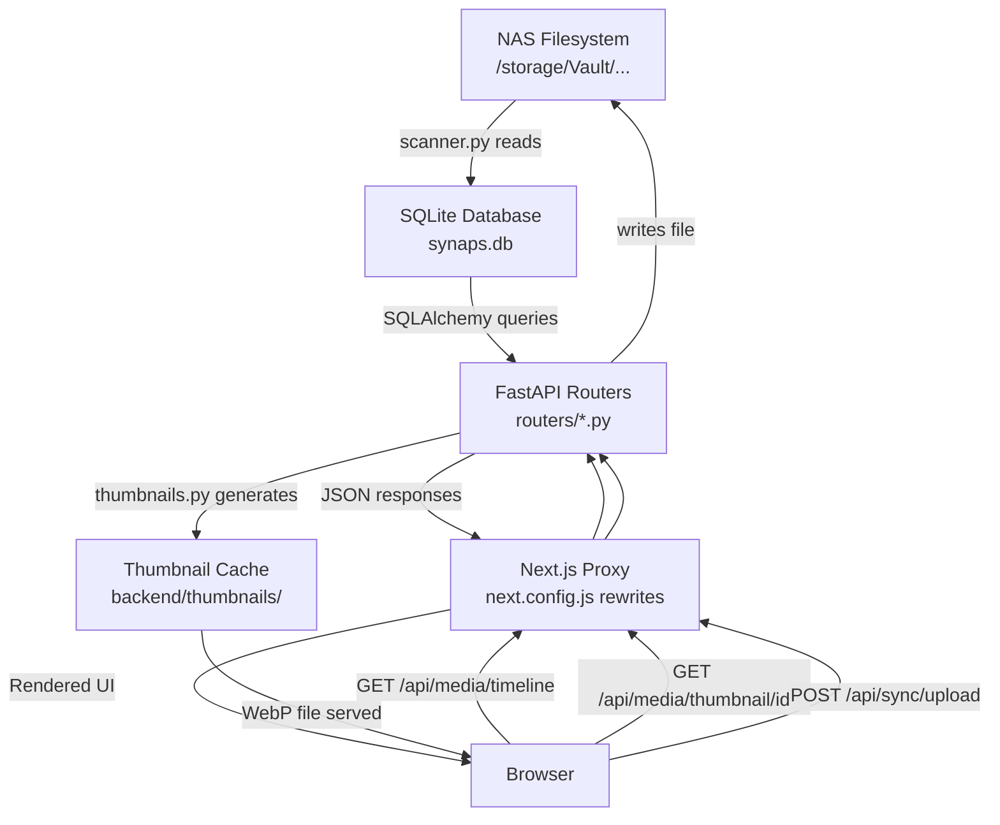

# 01 — Project Overview

> **Synaps** is a personal media cloud for your NAS (Network Attached Storage). It is a web application you run on your home server that lets you browse photos, videos, and documents as if you were using Google Photos — but 100% locally, with no cloud subscription.

---

## The Big Picture (Simple Explanation)

Think of Synaps like this:

```
Your NAS hard drive (raw files)
        ↓
  Backend (FastAPI — Python)   ← the "brain"
        ↓
  Frontend (Next.js — React)   ← the "face"
        ↓
  Your browser (phone or laptop on the same WiFi)
```

- The **backend** reads your files, builds a database of them, generates thumbnails, and serves them through an API.
- The **frontend** is a beautiful web UI that talks to the backend to show you your files.
- You access the whole thing from any browser on your local network.

---

## How the Frontend and Backend Communicate

This is the single most important concept to understand.

### The Proxy Pattern

The frontend (Next.js running on port `3000`) does **NOT** call the backend (FastAPI running on port `8000`) directly. Instead, every API call goes through a **proxy rewrite** configured in `frontend/next.config.js`:

```js
// frontend/next.config.js
async rewrites() {
  return [
    {
      source: '/api/:path*',
      destination: 'http://localhost:8000/api/:path*',
    },
  ];
},
```

**What this means in practice:**
- Browser sends: `GET http://localhost:3000/api/media/timeline`
- Next.js intercepts it (server-side) and forwards it to: `GET http://localhost:8000/api/media/timeline`
- Backend responds → Next.js sends the response back to the browser

This is why the frontend code in `src/lib/api.ts` always uses `/api/...` without specifying a port — Next.js handles the forwarding transparently.

> ⚠️ **Critical insight**: If you change the backend port (from 8000 to something else), you MUST update `next.config.js` too, or every API call will fail.

---

## How Media Flows Through the System

```
NAS Filesystem (raw photos/videos)
       ↓  (1. Scanner reads files)
   SQLite Database (synaps.db)
       ↓  (2. API serves media list)
   FastAPI Backend
       ↓  (3. Proxy forwards)
   Next.js Server
       ↓  (4. Rendered in browser)
   Your Browser
       ↓  (5. User clicks thumbnail)
   Thumbnail Request → Backend generates → Cached on disk → Served
```

### Step-by-step:

1. **Startup Scan**: When FastAPI starts, it immediately runs a background scan of whitelisted directories on your NAS.
2. **Database indexing**: Each file found gets a row in the SQLite database with metadata (filename, path, date, type).
3. **API serves data**: The frontend fetches `/api/media/timeline` → backend queries DB → returns JSON.
4. **Thumbnails on demand**: When your browser requests `/api/media/thumbnail/{id}`, the backend generates a WebP thumbnail (or returns the cached one).
5. **Viewing files**: When you open a photo, the browser fetches the full file from `/api/media/file/{id}`.

---

## Request Lifecycle (A Full Walk-Through)

Let's trace what happens when you open the app and see the timeline:

```
1. Browser opens http://nas-ip:3000
2. Next.js renders layout.tsx → wraps page in AppShell (Sidebar + MediaViewer)
3. page.tsx (Timeline) runs useEffect → calls getTimeline()
4. getTimeline() → fetch('/api/media/timeline?page=1&per_page=80')
5. Next.js proxy → http://localhost:8000/api/media/timeline?page=1&per_page=80
6. FastAPI routes to routers/media.py → get_timeline()
7. get_timeline() queries SQLite → groups by month/year → returns JSON
8. JSON flows back → Next.js → Browser
9. React renders MediaGrid with the items
10. Browser loads each thumbnail via 
11. Each thumbnail request → FastAPI → generate_thumbnail() → WebP served
```

---

## Architecture Overview

```
nas_dashboard/
├── backend/                 ← Python / FastAPI application
│   ├── main.py             ← Entry point, startup, router registration
│   ├── config.py           ← All configuration variables
│   ├── database.py         ← SQLAlchemy setup
│   ├── models.py           ← Database table definitions
│   ├── scanner.py          ← Filesystem indexer
│   ├── thumbnails.py       ← Thumbnail generation engine
│   └── routers/            ← API endpoint handlers
│       ├── media.py        ← Timeline, file serving, thumbnails
│       ├── finder.py       ← Directory browsing
│       ├── sync.py         ← File upload / iPhone sync
│       ├── search.py       ← Search functionality
│       ├── trash.py        ← Trash management
│       └── settings.py     ← App settings + storage stats
│
├── frontend/               ← TypeScript / Next.js 14 application
│   └── src/
│       ├── app/            ← Pages (Next.js App Router)
│       │   ├── layout.tsx  ← Root layout (wraps all pages)
│       │   ├── page.tsx    ← Timeline page (home: /)
│       │   ├── finder/     ← /finder — file browser
│       │   ├── search/     ← /search — media search
│       │   ├── sync/       ← /sync — upload from iPhone
│       │   ├── trash/      ← /trash — deleted files
│       │   └── settings/   ← /settings — app configuration
│       ├── components/     ← Reusable UI components
│       │   ├── AppShell.tsx  ← Outer wrapper (Sidebar + layout)
│       │   ├── Sidebar.tsx   ← Navigation sidebar
│       │   ├── TopBar.tsx    ← Top bar with title + search
│       │   ├── MediaGrid.tsx ← Photo/video grid
│       │   └── MediaViewer.tsx ← Fullscreen media viewer
│       └── lib/
│           ├── api.ts      ← All backend API calls
│           └── store.ts    ← Global state (Zustand)
│
├── start.sh                ← Start both services (development)
├── start-prod.sh           ← Start both services (production)
├── deploy.sh               ← Push code to Git
├── update.sh               ← Pull + rebuild on NAS
└── mock_storage/           ← Local fake NAS files for development
```

---

## Data Flow Diagram



---

## Technology Stack

| Layer | Technology | Version | Why |
|-------|-----------|---------|-----|
| Backend framework | FastAPI | Latest | Fast, async, auto-docs at /docs |
| Backend language | Python 3.11+ | - | Easy ecosystem for file processing |
| ORM (DB library) | SQLAlchemy | Latest | Maps Python objects ↔ DB rows |
| Database | SQLite | Built-in | No server needed, fits NAS perfectly |
| Image processing | Pillow + pillow-heif | Latest | Handle JPEG, PNG, HEIC |
| Video thumbnails | ffmpeg (system) | - | Extract video frames |
| EXIF metadata | exifread | Latest | Read camera date/GPS from photos |
| Frontend framework | Next.js | 14.2.15 | File-system routing, SSR, proxying |
| UI language | TypeScript + React 18 | - | Type safety, component model |
| State management | Zustand | 4.5.5 | Lightweight global state |
| Animations | Framer Motion | 11 | Smooth transitions |
| Icons | Lucide React | 0.454 | Clean icon set |
| Styling | Tailwind CSS v3 | 3.4 | Utility classes |

---

## Key Design Decisions & Why They Were Made

### 1. SQLite over PostgreSQL/MySQL
SQLite is a single file (`synaps.db`). There's no database server to run — perfect for a NAS that may have limited RAM. The tradeoff is it can't handle hundreds of simultaneous writes, but for a personal NAS (1–2 users), this is fine.

### 2. Thumbnail generation is lazy (on-demand)
Thumbnails are only generated when the browser first requests them. The result is cached on disk forever. This means the first time you open the app, thumbnails will be slow; after that, instant. This is ideal for a weak NAS.

### 3. The scanner runs in a background thread on startup
`main.py` uses `threading.Thread(target=run_initial_scan, daemon=True)` so the API starts responding immediately even while the scan is still happening.

### 4. Pagination with 80 items per page
The timeline fetches 80 items at a time, not all at once. This prevents the NAS from running out of memory when you have thousands of photos.

### 5. Next.js proxy rewrites instead of CORS headers
Rather than configuring the backend to allow cross-origin requests (which requires careful security handling), the frontend proxies all API requests through itself. This means from the browser's point of view, everything is on the same domain — much simpler.

---

## Common Entry Points for Debugging

| Problem | Where to look |
|---------|--------------|
| Timeline is empty | `backend/scanner.py` — did it find the right directories? |
| Thumbnails not loading | `backend/thumbnails.py` + check if ffmpeg/pillow-heif are installed |
| API calls failing | `frontend/src/lib/api.ts` + check browser Network tab |
| Sidebar not appearing | `frontend/src/components/Sidebar.tsx` + `store.ts` (sidebarOpen state) |
| Navigation broken | `frontend/src/app/layout.tsx` + `AppShell.tsx` |
| Uploads failing | `backend/routers/sync.py` + check SYNC_TARGET_DIR in config |
| Wrong files being indexed | `backend/config.py` → `ALLOWED_SCAN_PATHS` |
