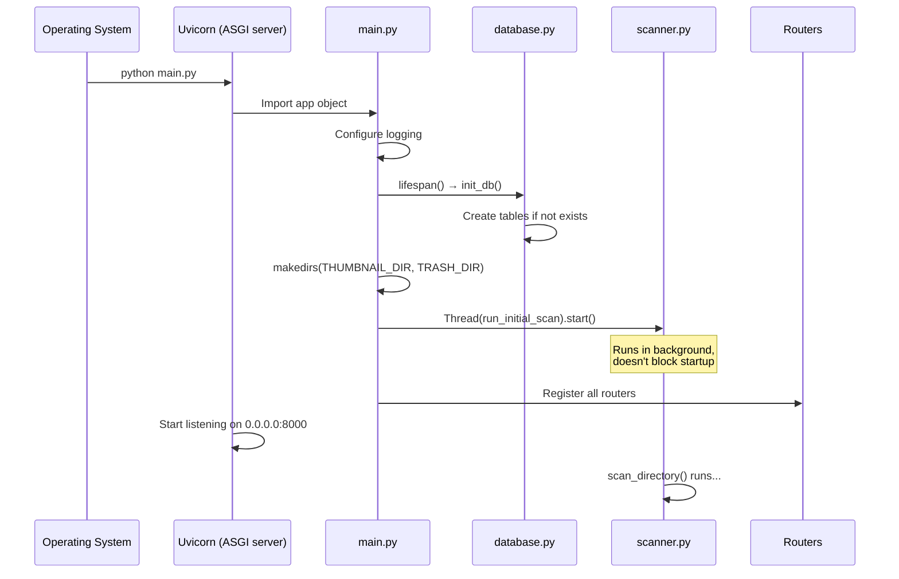
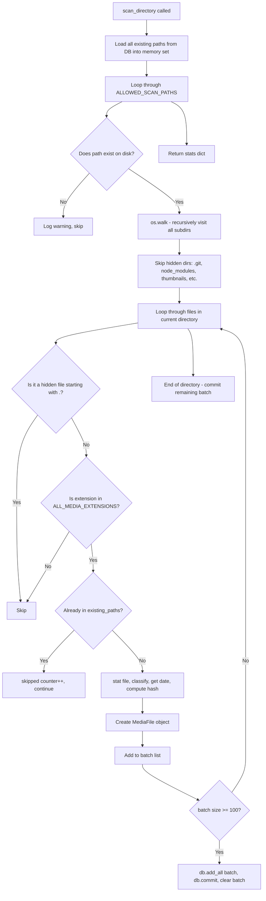
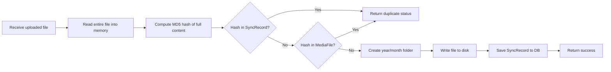
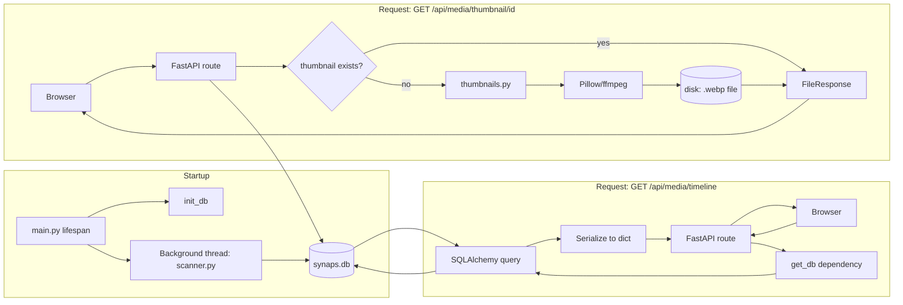

# 02 — Backend Architecture

The backend is a **FastAPI** Python application that lives entirely inside the `backend/` folder. It is the engine that powers Synaps — it reads your files, talks to the database, generates thumbnails, and serves everything through HTTP APIs.

---

## Startup Flow

When you run `python main.py` or `uvicorn main:app`, this is the exact sequence of events:



**Key insight**: The API is immediately ready to serve requests (at second 0). The scanner runs in parallel in a background thread. This means if you open the app right after starting the backend, you might see fewer items than expected — the scan is still running.

---

## File-by-File Breakdown

---

### `main.py` — The Entry Point

**Purpose**: Creates the FastAPI application, registers all routers, handles startup/shutdown.

**Key functions:**

#### `run_initial_scan()`
```python
def run_initial_scan():
    db = SessionLocal()
    try:
        stats = scan_directory(db)
    finally:
        db.close()
```
Creates its own database session (because it runs in a separate thread — explained more later), calls `scan_directory()`, logs the results.

#### `lifespan(app)` — Startup/Shutdown Context Manager
```python
@asynccontextmanager
async def lifespan(app: FastAPI):
    init_db()                          # Step 1: Create tables
    os.makedirs(THUMBNAIL_DIR, ...)    # Step 2: Create folders
    os.makedirs(TRASH_DIR, ...)
    scan_thread = threading.Thread(target=run_initial_scan, daemon=True)
    scan_thread.start()               # Step 3: Start background scan
    yield                             # App runs here...
    # (shutdown code would go here, but there is none)
```

The `yield` is the magic — everything before it is "startup", everything after it would be "shutdown". When the server stops, the thread is killed because `daemon=True`.

#### `POST /api/scan` — Manual Rescan Trigger
```python
@app.post("/api/scan")
def trigger_scan():
    thread = threading.Thread(target=run_initial_scan, daemon=True)
    thread.start()
    return {"status": "scan_started"}
```
This endpoint is called by the Settings page's "Rescan Now" button. Each click starts a completely new background thread. **Bug risk**: If you click it multiple times rapidly, you get multiple scan threads running at once. This is safe due to SQLAlchemy's `unique=True` constraint on the `path` column — duplicate inserts will raise an error and be caught by the `try/except` in the scanner.

**How routers are connected:**
```python
app.include_router(media_router)
app.include_router(finder_router)
# ... etc
```
Each router is just a collection of endpoints. `include_router()` tells FastAPI "add all the endpoints from this router to my app". This is equivalent to having all the endpoints in `main.py` itself, but organized into separate files.

---

### `config.py` — Central Configuration

**Purpose**: Single source of truth for all configurable values. Every other file imports from here.

```python
STORAGE_PATH = os.getenv("SYNAPS_STORAGE_PATH", str(PROJECT_ROOT / "mock_storage"))
```

This pattern means:
1. If the environment variable `SYNAPS_STORAGE_PATH` exists, use it
2. Otherwise, fall back to `mock_storage/` next to the project (for local development)

**The whitelist (`ALLOWED_SCAN_PATHS`):**
```python
ALLOWED_SCAN_PATHS = [
    os.path.join(STORAGE_PATH, "Vault", "Harsh", "Iphone"),
    os.path.join(STORAGE_PATH, "Vault", "Harsh", "Mac")
]
```

**This is the single most important configuration**. The scanner will ONLY look inside these two directories. If your photos are elsewhere on the NAS, they won't appear in the timeline.

> ⚠️ **Common bug source**: If you move your files to a different directory on the NAS and forget to update `ALLOWED_SCAN_PATHS`, your timeline will be empty.

**Media extension sets:**
```python
IMAGE_EXTENSIONS = {".jpg", ".jpeg", ".png", ...}
VIDEO_EXTENSIONS = {".mp4", ".mov", ".avi", ...}
DOCUMENT_EXTENSIONS = {".pdf", ".doc", ...}
```
These are Python sets (using `{}`). Sets have O(1) lookup time — checking if `.heic` is in `IMAGE_EXTENSIONS` is instantaneous.

**NAS hardware tuning:**
```python
SCAN_BATCH_SIZE = 100          # Commit every 100 files (limits memory)
MAX_CONCURRENT_THUMBNAILS = 2  # Only 2 thumbnails at once (Core2Duo friendly)
```

---

### `database.py` — Database Setup

**Purpose**: Creates the SQLAlchemy engine, session factory, and provides the `get_db` dependency.

```python
engine = create_engine(
    DATABASE_URL,
    connect_args={"check_same_thread": False},  # Required for SQLite in multi-thread
    echo=False,                                  # Set True to see all SQL queries
)
```

**Why `check_same_thread=False`?**  
SQLite normally only allows one thread to use a connection at a time. Our scanner runs in a background thread while FastAPI handles requests in another thread. This setting disables that restriction. SQLAlchemy manages thread safety through its session pool.

#### `get_db()` — The FastAPI Dependency
```python
def get_db():
    db = SessionLocal()
    try:
        yield db
    finally:
        db.close()
```

This is a **generator function** used as a FastAPI dependency. When a route declares `db: Session = Depends(get_db)`:
1. FastAPI calls `get_db()`
2. `SessionLocal()` creates a new database session
3. The session is yielded (passed) into your route function
4. After your route finishes (success or error), `db.close()` is always called

This guarantees sessions are never left open, which prevents database locking on SQLite.

#### `init_db()`
```python
def init_db():
    from models import MediaFile, TrashItem, SyncRecord, Setting  # noqa
    Base.metadata.create_all(bind=engine)
```

The `create_all` command checks the database and creates any tables that don't exist yet. It does NOT drop existing tables. This is safe to run every startup.

---

### `models.py` — Database Tables

**Purpose**: Defines what each table in the SQLite database looks like, using SQLAlchemy ORM.

#### `MediaFile` — The Main Table

Every photo/video/document that the scanner finds gets one row here.

| Column | Type | Purpose |
|--------|------|---------|
| `id` | String (UUID) | Unique identifier used in all API URLs |
| `filename` | String | Just the filename: `IMG_4532.HEIC` |
| `path` | String (unique) | Full absolute path: `/storage/Vault/...` |
| `relative_path` | String | Path relative to STORAGE_PATH |
| `directory` | String | Parent folder, relative to STORAGE_PATH |
| `extension` | String | `.heic`, `.mp4`, etc. |
| `mime_type` | String | `image/heic`, `video/mp4`, etc. |
| `file_size` | Integer | Bytes |
| `width`, `height` | Integer | Dimensions (NOT populated yet — always NULL) |
| `duration` | Float | Video length in seconds (NOT populated yet) |
| `media_type` | String | `"image"`, `"video"`, or `"document"` |
| `is_screenshot` | Boolean | True if filename contains "screenshot" |
| `is_screen_recording` | Boolean | True if filename contains "screen recording" |
| `is_raw` | Boolean | True if extension is .raw, .cr2, etc. |
| `is_favorite` | Boolean | User-toggled heart/favorite |
| `date_taken` | DateTime | EXIF date or best guess (see scanner) |
| `date_created` | DateTime | Filesystem birth time |
| `date_modified` | DateTime | Filesystem modification time |
| `date_indexed` | DateTime | When scanner found this file |
| `camera_make` | String | "Apple", "Canon", etc. (NOT populated yet) |
| `camera_model` | String | "iPhone 15 Pro" (NOT populated yet) |
| `gps_lat`, `gps_lon` | Float | GPS coordinates (NOT populated yet) |
| `has_thumbnail` | Boolean | True once a thumbnail has been generated |
| `thumbnail_path` | String | Absolute path to cached thumbnail WebP |
| `file_hash` | String | MD5 of first 64KB — used for deduplication |

> **Important gaps**: `width`, `height`, `duration`, `camera_make`, `camera_model`, `gps_lat`, `gps_lon` are defined in the model but the scanner never actually reads and stores them. They will always be `NULL` in the database. This is an area for future improvement.

#### `TrashItem`

When a file is "deleted", it's moved to the trash folder and a record is created here. The original `MediaFile` row is deleted.

#### `SyncRecord`

Every successful upload through the Sync page creates a record here. Used to detect duplicate uploads.

#### `Setting`

Simple key-value store for app settings like `theme = "dark"`.

---

### `scanner.py` — The Filesystem Indexer

**Purpose**: Walk through whitelisted directories, extract file metadata, and save it to the database.

This is the most complex file in the backend. Let's go function by function.

#### `classify_media(ext, filename)` → dict

Determines what type of media a file is based on its extension and filename:
- Extension → is it an image, video, or document?
- Filename → does it contain "screenshot" or "screen recording"?
- Extension → is it a raw camera file?

```python
# Example: classify_media(".heic", "IMG_4532.HEIC")
# Returns: {"media_type": "image", "is_screenshot": False, "is_screen_recording": False, "is_raw": False}

# Example: classify_media(".png", "Screenshot 2024-01-15 at 10.23.45.png")
# Returns: {"media_type": "image", "is_screenshot": True, ...}
```

#### `compute_file_hash(filepath)` → str

```python
def compute_file_hash(filepath, chunk_size=8192):
    hasher = hashlib.md5()
    with open(filepath, "rb") as f:
        data = f.read(65536)  # Only reads FIRST 64KB
    hasher.update(data)
    return hasher.hexdigest()
```

**Why only 64KB?** A full MD5 of a 50MB video takes seconds on a slow NAS. The first 64KB is enough to detect duplicates in practice (two different files almost never have identical first 64KB).

**Weakness**: Two files that are identical except for the last portion will have the same hash and be treated as duplicates. This is an acceptable tradeoff for performance.

#### `extract_exif_date(filepath)` → datetime or None

Uses the `exifread` library to read EXIF metadata from photo files. Only works on formats that support EXIF:
- `.jpg`, `.jpeg`, `.tiff`, `.heic`, `.heif`, `.raw`, `.cr2`, `.nef`, `.arw`, `.dng`

If `exifread` is not installed, this always returns `None` (scanner logs a warning).

#### `extract_date_from_filename(filename)` → datetime or None

Falls back to parsing the date from the filename if EXIF fails:
```python
patterns = [
    r'(\d{4})[\-_](\d{2})[\-_](\d{2})',  # YYYY-MM-DD or YYYY_MM_DD
    r'(\d{4})(\d{2})(\d{2})',             # YYYYMMDD
]
```

Examples of filenames this handles:
- `IMG_20230415_123456.jpg` → April 15, 2023
- `2024-01-20-photo.jpg` → January 20, 2024
- `20240120_143022.jpg` → January 20, 2024

#### `get_best_date(filepath, filename)` → datetime

The priority chain for determining a file's date:
1. EXIF `DateTimeOriginal` or `Image DateTime` ← most accurate
2. Date parsed from filename ← second best
3. Filesystem birth time (macOS) or modification time (Linux) ← fallback

#### `scan_directory(db, force_rescan=False)` → dict

This is the main scanning loop. Here is exactly what happens:



**Memory optimization**: Instead of querying the database for each file ("does this path already exist?"), it loads ALL existing paths into a Python `set` at the start. Then each lookup is O(1) — instant. For 10,000 files, this avoids 10,000 database queries.

**Batch commits**: Files are committed to the database in groups of 100 (`SCAN_BATCH_SIZE`). This balances memory usage (not holding 10,000 objects in RAM) with database write efficiency (not committing 10,000 times one by one).

---

### `thumbnails.py` — Thumbnail Generation Engine

**Purpose**: Generate a small preview image for any media file. Cache it to disk.

#### `get_thumbnail_path(file_path)` → str

```python
def get_thumbnail_path(file_path):
    path_hash = hashlib.md5(file_path.encode()).hexdigest()
    return os.path.join(THUMBNAIL_DIR, f"{path_hash}.webp")
```

The thumbnail filename is the MD5 hash of the **original file's path**. This is deterministic — given the same input path, you always get the same thumbnail filename. This serves as the cache key.

Example:
- Input: `/storage/Vault/Harsh/Iphone/2024/01/IMG_4532.HEIC`
- MD5 of path string: `a3f7b9c2...`
- Thumbnail path: `backend/thumbnails/a3f7b9c2....webp`

#### `generate_image_thumbnail(source, thumb_path)` → bool

Uses Pillow. Works for JPEG, PNG, WebP. Also works for HEIC **if pillow-heif is installed**.

```python
with Image.open(source_path) as img:
    if img.mode in ('RGBA', 'LA', 'P'):
        img = img.convert('RGB')    # WebP doesn't support alpha
    img.thumbnail(THUMBNAIL_SIZE, Image.LANCZOS)
    img.save(thumb_path, "WEBP", quality=75)
```

`img.thumbnail()` is in-place — it resizes the image so it FITS within (320, 320) while maintaining aspect ratio. A 4:3 photo becomes ~320×240. A portrait becomes ~240×320.

#### `generate_video_thumbnail(source, thumb_path)` → bool

Calls `ffmpeg` as a subprocess (ffmpeg must be installed separately):

```bash
ffmpeg -y -ss 0.5 -i video.mp4 -vframes 1 -vf "scale=320:-1" -q:v 5 thumbnail.jpg
```

- `-ss 0.5` → seek to 0.5 seconds into the video
- `-vframes 1` → extract exactly 1 frame
- `-vf scale=320:-1` → resize to width 320, keep aspect ratio
- If 0.5s seek fails (very short video), retries without `-ss`

**Why ffmpeg not Python?** Python video libraries (like OpenCV or moviepy) are heavy and unreliable. `ffmpeg` is the gold standard and most systems have it available.

#### `generate_pdf_thumbnail(source, thumb_path)` → bool

Uses `pdftoppm` (from the `poppler-utils` package). Extracts the first page as a PNG, then converts to WebP with Pillow.

> ⚠️ **Known failure modes**:
> - HEIC fails if `pillow-heif` not installed → install with `pip install pillow-heif`
> - Videos fail if `ffmpeg` not installed → `sudo apt install ffmpeg`
> - PDFs fail if `poppler-utils` not installed → `sudo apt install poppler-utils`

#### `generate_thumbnail(source_path)` → str | None

The main entry point for thumbnail generation:
```python
def generate_thumbnail(source_path):
    thumb_path = get_thumbnail_path(source_path)
    
    if os.path.exists(thumb_path):  # Cache hit!
        return thumb_path
    
    # Dispatch based on extension
    if ext in VIDEO_EXTENSIONS:
        success = generate_video_thumbnail(source_path, thumb_path)
    elif ext in PDF_EXTENSIONS:
        success = generate_pdf_thumbnail(source_path, thumb_path)
    else:
        success = generate_image_thumbnail(source_path, thumb_path)
    
    return thumb_path if success else None
```

This is lazy generation — thumbnails are only made when first requested, then cached on disk forever.

---

## The Routers — API Endpoints

### `routers/media.py` — Timeline & File Serving

Prefix: `/api/media`

#### `GET /api/media/timeline` → Timeline groups

This is the most-called endpoint. It:
1. Applies filters (media_type, year, month)
2. Counts total matching items (for pagination math)
3. Fetches `per_page` items sorted by `date_taken` descending
4. **Groups them by year-month** in Python (not SQL)
5. Returns sorted groups

```python
# Grouping logic
for item in items:
    dt = item.date_taken or item.date_created or datetime.now()
    key = dt.strftime("%Y-%m")      # e.g., "2024-01"
    if key not in groups:
        groups[key] = {"year": 2024, "month": 1, "month_name": "January", "items": []}
    groups[key]["items"].append(_serialize_media(item))
```

**Pagination risk**: Because grouping happens after fetching `per_page` items, a group can be split across pages. If page 1 returns 80 items and 3 of them belong to "January 2024", then page 2 might also return items from "January 2024". The frontend merges these using the `loadedIdsRef` deduplication set.

#### `GET /api/media/thumbnail/{media_id}`

1. Look up the MediaFile by ID in DB
2. Check if thumbnail already exists on disk
3. If yes → serve it directly as FileResponse
4. If no → generate it → serve it → update DB (`has_thumbnail = True`)
5. Fallback: if generation fails but it's an image, serve the original file

#### `_serialize_media(item, full=False)` — Helper

Converts a `MediaFile` database object into a plain Python dict for JSON:
```python
return {
    "id": item.id,
    "thumbnail_url": f"/api/media/thumbnail/{item.id}",
    "file_url": f"/api/media/file/{item.id}",
    ...
}
```

`full=True` adds extra fields (path, camera info, GPS) — used by the MediaViewer detail panel.

---

### `routers/finder.py` — Directory Browser

Prefix: `/api/finder`

#### `GET /api/finder/browse?path=Vault/Harsh`

Path traversal protection:
```python
clean_path = os.path.normpath(path).lstrip("/")
if ".." in clean_path:
    raise HTTPException(400)
```

`os.path.normpath` collapses `/../../etc/passwd` attempts. The `..` check adds a second layer of safety.

**Response structure:**
```json
{
  "current_path": "Vault/Harsh",
  "breadcrumb": [{"name": "Storage", "path": ""}, {"name": "Vault", "path": "Vault"}, ...],
  "folders": [...],
  "files": [...]
}
```

Note: The Finder shows ALL file types (not just media) because it's a general file browser.

---

### `routers/sync.py` — File Upload

Prefix: `/api/sync`

#### `POST /api/sync/upload` — The Upload Flow



**File organization pattern:**
```
SYNC_TARGET_DIR/
  2024/
    01/    ← January 2024
      IMG_4532.HEIC
      IMG_4533.HEIC
    02/    ← February 2024
```

**Name collision handling:**
```python
dest_path = os.path.join(year_month_dir, file.filename)
counter = 1
while os.path.exists(dest_path):
    dest_path = f"{base_name}_{counter}{ext}"
    counter += 1
```

If `IMG_4532.HEIC` already exists, saves as `IMG_4532_1.HEIC`, then `IMG_4532_2.HEIC`, etc.

**Memory concern**: `content = await file.read()` reads the ENTIRE file into RAM before writing. For a 50MB RAW photo, that's 50MB in memory per concurrent upload. Fine for personal use, would be a problem for high-concurrency.

---

### `routers/search.py` — Search

Prefix: `/api/search`

#### `GET /api/search/?q=keyword`

Simple SQL LIKE search:
```python
query.filter(or_(
    MediaFile.filename.ilike(f"%{q}%"),
    MediaFile.directory.ilike(f"%{q}%"),
    MediaFile.relative_path.ilike(f"%{q}%"),
))
```

`ilike` = case-insensitive LIKE. `%keyword%` means "contains keyword anywhere".

**Limitation**: This is substring search only. Searching "cat" won't find "Cat_photo.jpg" unless the filesystem has case-insensitive matching for the search term (it does because of `ilike`). But there's no semantic search — "sunset photos" won't find photos taken at sunset.

---

### `routers/trash.py` — Trash Management

Prefix: `/api/trash`

#### `POST /api/trash/delete/{media_id}`

1. Finds `MediaFile` in DB
2. `shutil.move(original_path, trash_path)` — physically moves the file
3. Creates a `TrashItem` record with `auto_delete_at = now + 30 days`
4. **Deletes the `MediaFile` row** from DB

This is why deleted items disappear from the timeline immediately — the DB row is gone.

#### `POST /api/trash/restore/{trash_id}`

1. `shutil.move(trash_path, original_path)` — moves it back
2. Deletes the `TrashItem` row

**Bug**: After restoring, there is no `MediaFile` row in the database anymore (it was deleted). The file physically exists back in its original location, but it won't appear in the timeline until the next scan. You would need to manually trigger a rescan after restoring files.

---

### `routers/settings.py` — Settings

Prefix: `/api/settings`

Simple key-value store. The `GET /api/settings/storage-usage` endpoint is interesting — it physically walks the thumbnail and trash directories to compute their size, which could be slow if you have thousands of thumbnails.

---

## Backend Data Flow Diagram



---

## Threading and Concurrency Model

FastAPI is an **async** framework, but the scanner uses **threading** (sync). Here's why this matters:

```
FastAPI async event loop (thread 1)
    Handles: all API requests, thumbnail serving, etc.
    Can run multiple coroutines "simultaneously" (cooperative multitasking)

Scanner background thread (thread 2)
    Handles: filesystem walking, DB writes during scan
    Is synchronous (blocking I/O)
```

These two threads share the database. SQLAlchemy handles this safely through its connection pool, and `check_same_thread=False` is set. Each thread creates its own database session.

**Why not `async` scanner?**
File I/O in Python is not truly async unless you use `aiofiles`. The scanner uses regular `open()` and `os.walk()`. Running this in a thread means the async event loop (which handles your API requests) is not blocked while the scanner is working.

---

## The Dependency Injection Pattern

Every route that needs database access looks like this:

```python
@router.get("/timeline")
def get_timeline(
    page: int = Query(1),
    db: Session = Depends(get_db),   # ← FastAPI injects this
):
    items = db.query(MediaFile).all()
```

`Depends(get_db)` tells FastAPI: "Before calling this function, run `get_db()` and pass its result as `db`". FastAPI handles creating and closing the session automatically. You never have to worry about calling `db.close()` in route functions.
