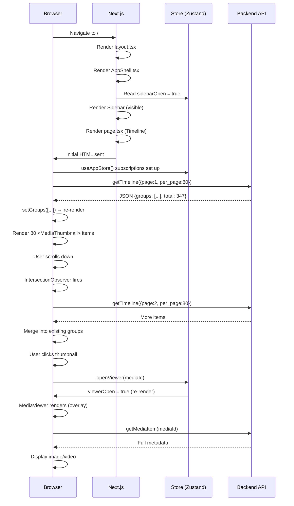

# 03 — Frontend Architecture

The frontend is a **Next.js 14** application written in TypeScript. It lives in the `frontend/` folder and is the visual interface you see in your browser.

---

## What is Next.js App Router?

Next.js 14 uses the "App Router" — a system where **folders become URLs**. Here's the mental model:

```
src/app/
├── layout.tsx          → Runs for EVERY page (the outer shell)
├── page.tsx            → The "/" route (Timeline page)
├── finder/
│   └── page.tsx        → The "/finder" route
├── search/
│   └── page.tsx        → The "/search" route
├── sync/
│   └── page.tsx        → The "/sync" route
├── trash/
│   └── page.tsx        → The "/trash" route
└── settings/
    └── page.tsx        → The "/settings" route
```

When you navigate to `/finder`, Next.js loads:
1. `layout.tsx` (always)
2. `finder/page.tsx` (for this specific route)

---

## Server Components vs Client Components

Next.js has two types of components:

| Type | Marker | Runs on | Can use |
|------|--------|---------|---------|
| Server Component | (default, no marker) | Server only | Database, filesystem |
| Client Component | `'use client'` at top | Browser | React hooks, events, state |

**In Synaps, almost everything is a Client Component** because:
- The app needs React state (`useState`, `useEffect`)
- Components need to respond to user clicks and input
- Real-time-ish behavior (infinite scroll, media viewer)

The ONLY server component is `layout.tsx` — and even that imports `AppShell` which is a Client Component.

---

## File-by-File Breakdown

---

### `src/app/layout.tsx` — Root Layout

This wraps every single page. It:
1. Sets the HTML `<head>` metadata (title, description, viewport)
2. Loads the Google Fonts link (Inter font)
3. Wraps everything in `<AppShell>`

```tsx
export default function RootLayout({ children }) {
  return (
    <html lang="en" className="dark">
      <body className="bg-white dark:bg-[#0a0a0b]">
        <AppShell>{children}</AppShell>
      </body>
    </html>
  );
}
```

`{children}` is the current page — it changes as you navigate. `AppShell` stays the same.

**The dark mode setup**: `className="dark"` on `<html>` enables dark mode globally (Tailwind uses class-based dark mode). The settings page can change this via JavaScript.

---

### `src/components/AppShell.tsx` — The Outer Shell

```tsx
'use client';

export function AppShell({ children }) {
  const { sidebarOpen } = useAppStore();
  return (
    <>
      <Sidebar />
      <MediaViewer />
      <main className={`... ${sidebarOpen ? 'lg:ml-[260px]' : ''}`}>
        {children}
      </main>
    </>
  );
}
```

**What it does:**
- Renders `<Sidebar>` (always present, toggleable)
- Renders `<MediaViewer>` (always present, hidden until you open a photo)
- Renders `<main>` which contains the current page (`{children}`)
- When sidebar is open on desktop (`lg:` prefix = ≥1024px), adds `ml-[260px]` to push main content right

**The sidebar open state**: Sidebar defaults to `sidebarOpen: true` (set in `store.ts`). On desktop, this means it's always visible. On mobile (< 1024px), the sidebar overlaps the content as a drawer.

> **Why sidebar nav might feel broken**: The sidebar uses `AnimatePresence` — the sidebar only renders in the DOM when `sidebarOpen` is true. On mobile, if someone sets `sidebarOpen = false`, the sidebar completely unmounts. The navigation links only exist inside the sidebar, so if the sidebar is closed, there's no visible navigation at all. There is no persistent bottom nav bar for mobile.

---

### `src/components/Sidebar.tsx` — Navigation

**The navigation items:**
```tsx
const navItems = [
  { href: '/', label: 'Timeline', icon: Clock },
  { href: '/finder', label: 'Finder', icon: Folder },
  { href: '/sync', label: 'Sync', icon: Upload },
  { href: '/search', label: 'Search', icon: Search },
  { href: '/trash', label: 'Trash', icon: Trash2 },
  { href: '/settings', label: 'Settings', icon: Settings },
];
```

Each becomes a Next.js `<Link>` component. `<Link>` performs **client-side navigation** — it doesn't do a full page reload, just swaps the content area.

**Active state detection:**
```tsx
const pathname = usePathname();
const isActive = pathname === item.href;
```

`usePathname()` returns the current URL path. This is how the active nav item gets highlighted.

**The filter buttons** (Photos, Videos, Screenshots, etc.) are NOT navigation links — they're `<button>` elements that call `setFilter()` on the global store. This changes `activeFilter` state, which the Timeline page reads to filter its data.

**Mobile behavior**: On mobile (`window.innerWidth < 1024`), clicking a nav link closes the sidebar:
```tsx
onClick={() => {
  if (window.innerWidth < 1024) setSidebarOpen(false);
}}
```

**Known navigation issue**: Because the sidebar is wrapped in `<AnimatePresence>` with a conditional render, it only shows when `sidebarOpen = true`. The initial value is `true` — so the sidebar IS shown on first load. But if a user closes it and the state is not persisted (Zustand state resets on page refresh), the sidebar reopens on every page load. This is actually fine — users just always see the sidebar open initially.

---

### `src/components/TopBar.tsx` — Top Bar

Simple header component. Shows:
- Hamburger menu button (calls `toggleSidebar()`)
- Page title and subtitle
- Search icon link (goes to `/search`)

Every page has its own `<TopBar>` with its own title.

---

### `src/app/page.tsx` — Timeline (Home Page)

This is the most complex frontend component. Let's break it down completely.

**State variables:**
```tsx
const [groups, setGroups] = useState<TimelineGroup[]>([]);   // The month groups shown
const [loading, setLoading] = useState(true);                // Initial load spinner
const [loadingMore, setLoadingMore] = useState(false);       // Infinite scroll spinner
const [page, setPage] = useState(1);                         // Current page number
const [hasMore, setHasMore] = useState(true);                // Whether more pages exist
const [stats, setStats] = useState<any>(null);               // Library stats for subtitle
const [collapsedGroups, setCollapsedGroups] = useState<Set<string>>(new Set()); // Collapsed months
const loadedIdsRef = useRef<Set<string>>(new Set());         // Dedup tracker (not re-render trigger)
```

#### The `fetchPage` Function

```tsx
const fetchPage = useCallback(async (pageNum, reset = false) => {
  if (reset) {
    setLoading(true);     // Show full-page spinner
  } else {
    setLoadingMore(true); // Show bottom spinner
  }

  const data = await getTimeline({ page: pageNum, per_page: 80, ...filters });

  if (reset) {
    loadedIdsRef.current = new Set();  // Clear dedup tracking
    // Build fresh groups with dedup
    setGroups(newGroups);
  } else {
    // Merge new items into existing groups
    setGroups(prev => mergedGroups);
  }
  
  setHasMore(pageNum < data.total_pages);
}, [activeFilter]);
```

**Why `useCallback`?** Without it, `fetchPage` would be a brand new function reference every re-render, causing the `useEffect` that depends on it to re-run forever (infinite loop).

#### The Three `useEffect` Hooks

**Effect 1: Filter change → reset and reload**
```tsx
useEffect(() => {
  setPage(1);
  setGroups([]);
  setHasMore(true);
  fetchPage(1, true);
}, [activeFilter]); // intentionally exclude fetchPage
```

When `activeFilter` changes (user clicks "Photos" in sidebar), the entire timeline resets and reloads from page 1.

> **Important**: The comment says "intentionally exclude fetchPage". If `fetchPage` were in the deps array, this effect would re-run every time `fetchPage` changes. Since `fetchPage` itself depends on `activeFilter` (via `useCallback`), this would create an infinite loop: filter changes → fetchPage changes → effect runs → filter changes... Instead, the effect only runs when `activeFilter` changes directly.

**Effect 2: Fetch stats on mount**
```tsx
useEffect(() => {
  getMediaStats().then(setStats).catch(console.error);
}, []);  // [] = run once on mount
```

**Effect 3: Infinite scroll with IntersectionObserver**
```tsx
useEffect(() => {
  const observer = new IntersectionObserver(
    (entries) => {
      if (entries[0].isIntersecting && hasMore && !loading && !loadingMore) {
        setPage(prev => {
          const next = prev + 1;
          fetchPage(next);
          return next;
        });
      }
    },
    { threshold: 0.1 }
  );
  observer.observe(observerRef.current);
  return () => observer.disconnect();
}, [hasMore, loading, loadingMore, fetchPage]);
```

There's an invisible `<div ref={observerRef} />` at the bottom of the page. When this div becomes 10% visible (scrolled into view), the observer fires and loads the next page.

#### Rendering

```tsx
{groups.map((group) => {
  const key = `${group.year}-${group.month}`;
  const collapsed = collapsedGroups.has(key);
  return (
    <section key={key}>
      <button onClick={() => toggleGroup(key)}>
        {group.month_name} {group.year} ({group.items.length} items)
      </button>
      {!collapsed && <MediaGrid items={group.items} />}
    </section>
  );
})}
```

Each month group is a `<section>` with a sticky header button. Clicking the header collapses/expands that month's grid.

---

### `src/components/MediaGrid.tsx` — The Photo Grid

Renders the `media-grid` CSS class (defined in `globals.css`) which is a responsive CSS Grid:

```css
.media-grid {
  display: grid;
  grid-template-columns: repeat(auto-fill, minmax(160px, 1fr));
  gap: 4px;
}
```

`auto-fill` + `minmax(160px, 1fr)` means: "create as many columns as fit, each at least 160px wide". On a phone, that's ~2 columns. On a laptop, ~6–8 columns.

#### `MediaThumbnail` — Individual Photo Cell

```tsx
function MediaThumbnail({ item, index }) {
  const [loaded, setLoaded] = useState(false);   // Image loaded?
  const [error, setError] = useState(false);     // Image failed?
  const { openViewer } = useAppStore();

  return (
    <motion.div onClick={() => openViewer(item.id)}>
      {!loaded && !error && <div className="skeleton" />}  {/* shimmer */}
       setLoaded(true)}
        onError={() => { setError(true); setLoaded(true); }}
      />
      {error && <div>ERR</div>}       {/* fallback text */}
      {video && <PlayIcon />}          {/* video overlay */}
      {favorite && <StarIcon />}       {/* favorite badge */}
    </motion.div>
  );
}
```

**Loading sequence:**
1. Component mounts → shows skeleton shimmer, starts loading image
2. Image loads successfully → `setLoaded(true)` → skeleton hidden, image shown
3. Image fails (404, network error) → `setError(true)` → skeleton hidden, extension text shown

`loading="lazy"` means the browser won't even start fetching the thumbnail until it's close to the viewport — critical for performance on large libraries.

---

### `src/components/MediaViewer.tsx` — Fullscreen Viewer

A fullscreen overlay rendered at the `AppShell` level (not inside any specific page). This means it persists across navigations.

**Opening the viewer:**
```tsx
// Any component can do this:
const { openViewer } = useAppStore();
openViewer(mediaId);  // Sets viewerOpen = true, viewerMediaId = id
```

**What happens when you open it:**
```tsx
useEffect(() => {
  if (viewerMediaId) {
    setLoading(true);
    setZoom(1);
    getMediaItem(viewerMediaId)   // Fetches FULL metadata from /api/media/item/{id}
      .then(setMedia)
      .finally(() => setLoading(false));
  }
}, [viewerMediaId]);
```

**Features:**
- Zoom: `+`/`-` keys or buttons (scale 0.5x to 5x)
- Favorite toggle: calls `POST /api/media/favorite/{id}`
- Delete: calls `POST /api/trash/delete/{id}` then closes viewer
- Info panel: slides in from the right with full metadata
- Video: uses `<video controls autoPlay>` with stream URL
- Images: uses `` with original file URL

---

### `src/app/finder/page.tsx` — File Browser

State machine:
```tsx
const [currentPath, setCurrentPath] = useState('');    // Current directory path
const [data, setData] = useState(null);                // Browse response
const [loading, setLoading] = useState(true);
const [error, setError] = useState(null);
```

The `navigate(path)` function:
1. Sets the new current path
2. Calls `browseDirectory(path)` → `GET /api/finder/browse?path=...`
3. Updates `data` state with folders and files

**Breadcrumb navigation**: The backend returns a `breadcrumb` array. Each crumb is a button that calls `navigate(crumb.path)`.

**Back button**: Splits `currentPath` on `/`, removes the last segment, navigates there:
```tsx
const parent = currentPath.split('/').slice(0, -1).join('/');
navigate(parent);
```

---

### `src/app/search/page.tsx` — Search

Two-stage UX:
1. **Suggestions** (debounced, 200ms): Fires while typing, shows autocomplete dropdown
2. **Full search** (on Enter or suggestion click): Calls `searchMedia()` for full results

Debounce pattern:
```tsx
useEffect(() => {
  if (query.length < 1) { setSuggestions({}); return; }
  const timer = setTimeout(() => {
    getSearchSuggestions(query).then(setSuggestions);
  }, 200);  // Wait 200ms after last keystroke
  return () => clearTimeout(timer);  // Cancel if user keeps typing
}, [query]);
```

This prevents hammering the API on every keystroke.

---

### `src/app/sync/page.tsx` — Upload

The upload flow:
1. User selects files via `<input type="file" multiple>`
2. Files added to `uploads` state array with `status: 'pending'`
3. User clicks "Upload N files"
4. `startUpload()` loops through pending items sequentially (not parallel — intentional for NAS)
5. Each file: sets status to 'uploading' → calls `uploadFile()` → sets status to 'success'/'duplicate'/'error'

Sequential uploads prevent overwhelming the NAS CPU.

---

### `src/lib/api.ts` — API Client

Every backend call goes through the `fetchAPI` wrapper:
```tsx
async function fetchAPI(endpoint, options) {
  const res = await fetch(`/api${endpoint}`, options);
  if (!res.ok) {
    const error = await res.json().catch(() => ({ detail: res.statusText }));
    throw new Error(error.detail || 'API Error');
  }
  return res.json();
}
```

URL-only functions (for `` tags):
```tsx
export function getThumbnailUrl(id) {
  return `/api/media/thumbnail/${id}`;   // No fetch — just a URL string
}
```

---

### `src/lib/store.ts` — Global State (Zustand)

```tsx
const useAppStore = create<AppState>((set) => ({
  theme: 'dark',
  sidebarOpen: true,         // Sidebar starts open
  viewerOpen: false,
  viewerMediaId: null,
  activeFilter: null,        // null = "All Media"
  searchQuery: '',

  toggleSidebar: () => set((s) => ({ sidebarOpen: !s.sidebarOpen })),
  openViewer: (mediaId) => set({ viewerOpen: true, viewerMediaId: mediaId }),
  closeViewer: () => set({ viewerOpen: false, viewerMediaId: null }),
  setFilter: (filter) => set({ activeFilter: filter }),
}));
```

Zustand creates a single global store. Any component can read or update it via `useAppStore()`. State changes trigger re-renders only in components that read the changed piece of state.

**State is NOT persisted** — refreshing the page resets everything to these defaults. This means:
- Sidebar always starts open
- Active filter resets to "All Media"
- Viewer always starts closed

---

## Rendering Flow Diagram



---

## Styling System

Synaps uses **Tailwind CSS** with a custom design system defined in `tailwind.config.ts`.

### Custom Colors

The primary color palette is `synaps-*`:
- `synaps-500` = `#5c7cfa` (the main purple-blue)
- Used for active states, buttons, accents

### The `globals.css` Layer

CSS classes defined here can't be done in Tailwind alone:

| Class | Purpose |
|-------|---------|
| `.glass` | Glassmorphism background (blur + semi-transparent) |
| `.media-grid` | Responsive CSS Grid for thumbnails |
| `.media-thumb` | Square thumbnail with hover scale |
| `.skeleton` | Animated shimmer loading placeholder |
| `.month-header` | Sticky positioning for month labels |
| `.upload-progress` | Blue gradient progress bar |
| `.video-overlay` | Play button overlay on hover |

### Why Tailwind + Custom CSS?

Tailwind's utilities (`grid`, `rounded-2xl`, etc.) handle most styling. Custom CSS is used for:
- The media grid's `auto-fill` column behavior (can't be expressed in Tailwind)
- Skeleton shimmer animation
- CSS variables for glassmorphism

---

## Hydration and Client Components

**Why does `layout.tsx` import `AppShell` inside the function body?**

```tsx
// layout.tsx
import { AppShell } from '@/components/AppShell';
```

`layout.tsx` is a Server Component by default. `AppShell` has `'use client'` at the top. Next.js allows Server Components to import Client Components — the Client Component becomes the boundary. Everything inside `AppShell` (Sidebar, MediaViewer) runs client-side with full React state.

**Hydration**: When Next.js sends the initial HTML to the browser, it includes a static snapshot. React then "hydrates" this HTML — attaches event handlers and makes it interactive. This is why there can sometimes be a brief flash before the sidebar appears: the server renders with `sidebarOpen: true` but the client also needs to read the store.
