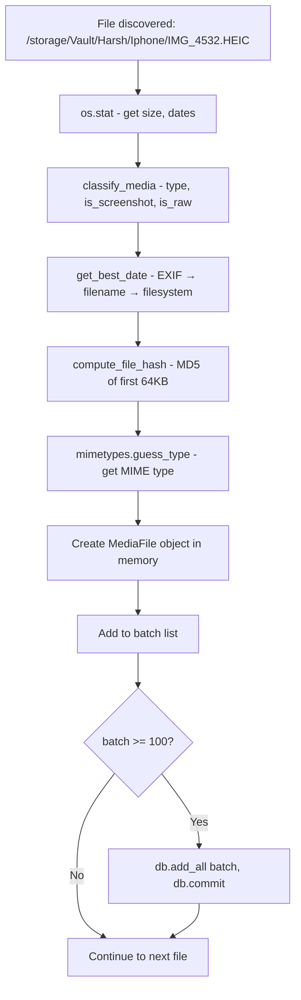

# 04 — Database and Indexing

The database is a **SQLite** file located at `backend/synaps.db`. SQLite is a database that lives in a single file on disk — no separate database server is needed.

---

## What is SQLite?

Think of SQLite like an extremely powerful Excel spreadsheet. Each "table" is like a sheet with rows and columns. The difference is:
- It supports SQL (a language for querying data)
- It can handle millions of rows efficiently
- It has indexes for fast lookups
- Multiple programs can read from it simultaneously (but only one can write at a time)

For a personal NAS with one or two users, SQLite is perfect.

---

## Database Schema

The database has 4 tables. Here's the complete schema:

### Table 1: `media_files`

This is the heart of Synaps. Every indexed file has one row here.

```sql
CREATE TABLE media_files (
    id           TEXT PRIMARY KEY,      -- UUID like "550e8400-e29b-41d4-a716-446655440000"
    filename     TEXT NOT NULL,         -- "IMG_4532.HEIC"
    path         TEXT NOT NULL UNIQUE,  -- "/storage/Vault/Harsh/Iphone/2024/01/IMG_4532.HEIC"
    relative_path TEXT NOT NULL,        -- "Vault/Harsh/Iphone/2024/01/IMG_4532.HEIC"
    directory    TEXT NOT NULL,         -- "Vault/Harsh/Iphone/2024/01"
    extension    TEXT NOT NULL,         -- ".heic"
    mime_type    TEXT,                  -- "image/heic"
    file_size    INTEGER DEFAULT 0,     -- 4521034 (bytes)
    width        INTEGER,               -- NULL (not populated yet)
    height       INTEGER,               -- NULL (not populated yet)
    duration     REAL,                  -- NULL (not populated yet; for videos, seconds)
    media_type   TEXT NOT NULL,         -- "image", "video", or "document"
    is_screenshot BOOLEAN DEFAULT 0,
    is_screen_recording BOOLEAN DEFAULT 0,
    is_raw       BOOLEAN DEFAULT 0,
    is_favorite  BOOLEAN DEFAULT 0,
    date_taken   DATETIME,              -- 2024-01-15 14:32:55
    date_created DATETIME,             -- Filesystem birth time
    date_modified DATETIME,            -- Filesystem modification time
    date_indexed DATETIME DEFAULT CURRENT_TIMESTAMP,
    camera_make  TEXT,                  -- NULL (not populated yet)
    camera_model TEXT,                  -- NULL (not populated yet)
    gps_lat      REAL,                  -- NULL (not populated yet)
    gps_lon      REAL,                  -- NULL (not populated yet)
    has_thumbnail BOOLEAN DEFAULT 0,
    thumbnail_path TEXT,               -- "/path/to/thumbnails/a3f7b9c2.webp"
    file_hash    TEXT                   -- "a3f7b9c2d4e5f6a7b8c9d0e1f2a3b4c5" (MD5 partial)
);
```

**Indexes on `media_files`:**
| Column | Why indexed |
|--------|-------------|
| `filename` | Search queries filter by filename |
| `path` | Uniqueness check during scanning |
| `directory` | Search queries filter by directory |
| `extension` | Filter by file type |
| `media_type` | Timeline filtering (images vs videos) |
| `is_screenshot` | Screenshot filter |
| `is_favorite` | Favorites filter |
| `date_taken` | Timeline ordering (the most important!) |
| `file_hash` | Deduplication checks |

An **index** in a database is like a book's index — it pre-sorts the data so lookups are instant instead of scanning every row. Without the `date_taken` index, sorting 50,000 photos by date would be slow.

---

### Example Rows

#### `media_files` — a real row from scanning

```
id:               "f47ac10b-58cc-4372-a567-0e02b2c3d479"
filename:         "IMG_4532.HEIC"
path:             "/storage/Vault/Harsh/Iphone/2024/01/IMG_4532.HEIC"
relative_path:    "Vault/Harsh/Iphone/2024/01/IMG_4532.HEIC"
directory:        "Vault/Harsh/Iphone/2024/01"
extension:        ".heic"
mime_type:        "image/heic"
file_size:        4521034
width:            NULL    ← not extracted yet
height:           NULL    ← not extracted yet
duration:         NULL
media_type:       "image"
is_screenshot:    0
is_screen_recording: 0
is_raw:           0
is_favorite:      0
date_taken:       "2024-01-15 14:32:55"    ← from EXIF
date_created:     "2024-01-15 14:33:01"
date_modified:    "2024-01-15 14:33:01"
date_indexed:     "2026-05-21 09:12:44"
camera_make:      NULL    ← not extracted yet
camera_model:     NULL    ← not extracted yet
gps_lat:          NULL    ← not extracted yet
gps_lon:          NULL    ← not extracted yet
has_thumbnail:    0
thumbnail_path:   NULL
file_hash:        "a3f7b9c2d4e5f6a7b8"
```

---

### Table 2: `trash_items`

When a file is deleted, its `media_files` row is removed and a `trash_items` row is created.

```sql
CREATE TABLE trash_items (
    id           TEXT PRIMARY KEY,
    original_path TEXT NOT NULL,     -- Where it came from
    trash_path   TEXT NOT NULL,      -- Where it is now (backend/trash/)
    filename     TEXT NOT NULL,
    file_size    INTEGER DEFAULT 0,
    media_type   TEXT,
    deleted_at   DATETIME DEFAULT CURRENT_TIMESTAMP,
    auto_delete_at DATETIME          -- 30 days after deletion
);
```

---

### Table 3: `sync_records`

Every successful upload through the Sync page creates a row here.

```sql
CREATE TABLE sync_records (
    id           TEXT PRIMARY KEY,
    filename     TEXT NOT NULL,
    file_hash    TEXT NOT NULL,      -- Used for duplicate detection
    file_size    INTEGER DEFAULT 0,
    destination_path TEXT NOT NULL,
    synced_at    DATETIME DEFAULT CURRENT_TIMESTAMP,
    source_device TEXT DEFAULT 'iPhone'
);
```

---

### Table 4: `settings`

Simple key-value configuration store.

```sql
CREATE TABLE settings (
    key        TEXT PRIMARY KEY,     -- "theme"
    value      TEXT,                 -- "dark"
    updated_at DATETIME
);
```

---

## How Media Gets Indexed

The indexing process happens in `scanner.py`. Here's what happens per file:



### The `path` column is the key deduplication mechanism

The `path` column has `unique=True` in the model. This means:
- If you try to insert two rows with the same path, the second insert will raise a database error
- The scanner prevents this by pre-loading all existing paths into a Python set and checking before inserting

So if you run the scanner twice, it won't add duplicate rows — it just skips files whose path is already in the database.

---

## Deduplication Strategy

Synaps has **two different deduplication mechanisms** for different purposes:

### 1. Scanner Deduplication (by path)

When the scanner runs, it checks: "Is this file's absolute path already in the database?"
- If yes → skip (don't create a duplicate row)
- If no → create a new row

This prevents duplicate timeline entries when rescanning.

**Limitation**: If you copy a photo to a different folder, both copies get indexed as separate items (they have different paths).

### 2. Upload Deduplication (by file hash)

When you upload via the Sync page, it checks: "Is the MD5 hash of this file's content already in the database?"
- Checks `sync_records` first
- Then checks `media_files`
- If found in either → returns `status: "duplicate"`

This prevents uploading the same photo twice, even if you give it a different filename.

**Limitation**: The scanner uses a partial hash (first 64KB of file). The upload uses a full content hash. These hashes won't match for large files! So a file that was already scanned from the NAS could still be "uploaded" via the Sync page if the full-content hash doesn't match any `sync_records` hash.

---

## Timeline Grouping (How the API Structures the Data)

The `GET /api/media/timeline` endpoint returns data grouped by month. Here's how:

**Step 1**: Fetch `per_page` items sorted by `date_taken` descending from the DB.

**Step 2**: In Python, group by `year-month`:
```python
groups = {}
for item in items:
    dt = item.date_taken or item.date_created or datetime.now()
    key = dt.strftime("%Y-%m")           # e.g., "2024-01"
    if key not in groups:
        groups[key] = {
            "year": dt.year,             # 2024
            "month": dt.month,           # 1
            "month_name": dt.strftime("%B"),  # "January"
            "items": [],
        }
    groups[key]["items"].append(item_data)
```

**Step 3**: Sort the groups descending (newest first).

**The pagination problem with grouping:**

Imagine you have 120 photos from January 2024. With `per_page=80`:
- Page 1 fetches 80 photos → 80 January photos → 1 group: `Jan 2024 (80 items)`
- Page 2 fetches next 80 → 40 remaining January + 40 February → 2 groups: `Jan 2024 (40 more items)`, `Feb 2024 (40 items)`

The frontend must MERGE these. It uses `loadedIdsRef` (a Set of seen IDs) to avoid showing the same photo twice:
```tsx
const newItems = group.items.filter(item => {
  if (loadedIdsRef.current.has(item.id)) return false;  // Skip seen items
  loadedIdsRef.current.add(item.id);
  return true;
});
```

---

## Indexing Strategy Analysis

### What is indexed well?

| Query | Index Used | Speed |
|-------|-----------|-------|
| Timeline (sorted by date_taken) | `date_taken` | Fast |
| Filter by media_type | `media_type` | Fast |
| Filter by is_favorite | `is_favorite` | Fast |
| Filter by is_screenshot | `is_screenshot` | Fast |
| Get file by ID | Primary key `id` | Instant |
| Skip existing paths in scanner | `path` (unique) | Fast |
| Dedup check by hash | `file_hash` | Fast |

### What is NOT indexed (can be slow)

| Query | Index | Performance |
|-------|-------|------------|
| Search by filename | `filename` (indexed) | OK for 50k files |
| Search by directory | `directory` (indexed) | OK |
| Filter by year | Uses `strftime("%Y", date_taken)` | **No function index** |
| Combined filters | Multiple columns | OK, SQLite does its best |

**The year filter issue**: When you filter by year:
```python
query.filter(func.strftime("%Y", MediaFile.date_taken) == str(year))
```

SQLite must apply the `strftime()` function to every row's `date_taken` value and compare. Even with an index on `date_taken`, SQLite can't use the index for function-based comparisons. For 10,000+ files, this query scans the entire table. It's still fast on modern hardware but could be slow on a Core2Duo NAS.

---

## Database File Location and Backups

The database file is at `backend/synaps.db` (about 112KB currently).

**To back up the database**, simply copy this file. SQLite is a single file — there's nothing else to back up for the database.

**To inspect the database manually**, you can use the SQLite command line:
```bash
cd backend/
sqlite3 synaps.db

# In the SQLite shell:
.tables                           # List all tables
SELECT COUNT(*) FROM media_files; # Count indexed files
SELECT filename, date_taken FROM media_files ORDER BY date_taken DESC LIMIT 10;
.quit
```

Or use a GUI tool like [DB Browser for SQLite](https://sqlitebrowser.org/) on your Mac.

---

## Duplicate Entry Issues

If you see the same photo appearing multiple times in the timeline, here are the causes:

### Cause 1: Race condition during scan

If the scan is triggered multiple times (e.g., two simultaneous `POST /api/scan` requests), two scan threads can try to insert the same file. The second insert will fail (unique constraint on `path`), but the scanner catches exceptions and continues — so you'd see error logs but no visible problem.

### Cause 2: File moved then rescanned

If a file is moved from one directory to another:
1. Old path is still in the database
2. New path gets a new entry in the database
3. The file appears twice — once pointing to the old (now dead) path, once to the new path

**Fix**: Run a database cleanup:
```bash
sqlite3 backend/synaps.db "DELETE FROM media_files WHERE NOT EXISTS (SELECT 1 FROM sqlite_schema WHERE name = 'media_files');"
# More specific: delete rows where the file no longer exists
```

There's no built-in "cleanup orphaned records" function in the current codebase. This would need to be added.

### Cause 3: Frontend pagination merge bug

The frontend uses `loadedIdsRef` to deduplicate items across pages. If this ref is not properly reset when filters change, stale IDs could cause some items to not show, or old items from a different filter to remain visible.

Check the `fetchPage` function — when `reset=true`, it runs:
```tsx
loadedIdsRef.current = new Set();   // ← resets the dedup tracker
```

This should be correct. If you still see duplicates in the UI, the issue is likely in the backend returning duplicate `id` values (which shouldn't happen with a UUID primary key).
