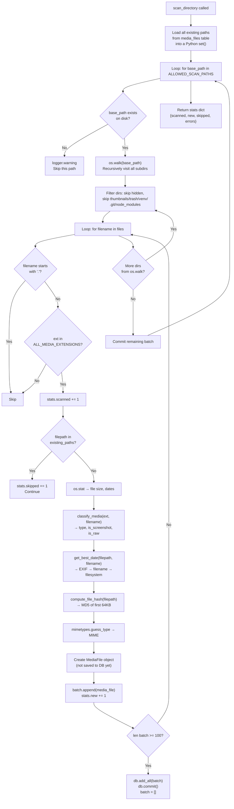

# 05 — Media Scanner

The scanner is the "indexer" — it's the part of Synaps that reads your raw NAS files and records them in the database so they can appear in the timeline.

**File**: `backend/scanner.py`

---

## What the Scanner Is NOT

The scanner does **not**:
- Copy, move, or modify any of your files
- Generate thumbnails (that's `thumbnails.py`)
- Watch for file changes in real-time
- Index ALL directories (only the whitelisted ones in `ALLOWED_SCAN_PATHS`)

---

## When the Scanner Runs

There are two triggers:

1. **Automatic**: Every time the backend starts (`main.py` lifespan), a background thread starts `scan_directory()`
2. **Manual**: When you click "Rescan Now" in Settings → calls `POST /api/scan`

Both triggers run `run_initial_scan()`:
```python
def run_initial_scan():
    db = SessionLocal()  # Creates its own DB session
    try:
        stats = scan_directory(db)
        logger.info(f"Scan complete: {stats}")
    except Exception as e:
        logger.error(f"Scan error: {e}", exc_info=True)
    finally:
        db.close()
```

---

## Scanner Flow — Step by Step



---

## Detailed Function Analysis

### `os.walk()` — The Recursive Directory Traversal

```python
for root, dirs, files in os.walk(base_path):
    # root = current directory being visited
    # dirs = list of subdirectory names in root
    # files = list of filenames in root
```

`os.walk()` is a generator — it yields one directory at a time, recursively. For a structure like:
```
/storage/Vault/Harsh/Iphone/
  2024/
    01/
      IMG_4532.HEIC
      IMG_4533.HEIC
    02/
      IMG_4600.HEIC
```

`os.walk` yields:
1. `root="/storage/.../Iphone", dirs=["2024"], files=[]`
2. `root="/storage/.../Iphone/2024", dirs=["01","02"], files=[]`
3. `root="/storage/.../Iphone/2024/01", dirs=[], files=["IMG_4532.HEIC","IMG_4533.HEIC"]`
4. `root="/storage/.../Iphone/2024/02", dirs=[], files=["IMG_4600.HEIC"]`

### Skipping Hidden/System Directories

```python
dirs[:] = [d for d in dirs if not d.startswith('.') and d not in {
    'thumbnails', 'trash', 'venv', '__pycache__', 'node_modules', '.git'
}]
```

**This is an in-place modification of `dirs`**. By modifying `dirs` in-place (using `[:]`), we tell `os.walk` not to descend into those directories at all. This is a Python-specific trick — just filtering `dirs` into a new variable won't work.

Without this, the scanner would try to:
- Index files inside `backend/thumbnails/` (those WebP thumbnail files)
- Index files inside `backend/venv/` (Python library files)
- Index files inside `frontend/node_modules/` (thousands of JS files)

This would add thousands of garbage entries to your timeline.

### `classify_media()` — File Classification

```python
def classify_media(ext, filename):
    ext_lower = ext.lower()
    name_lower = filename.lower()
    
    # Step 1: Determine media type by extension
    if ext_lower in IMAGE_EXTENSIONS:
        media_type = "image"
    elif ext_lower in VIDEO_EXTENSIONS:
        media_type = "video"
    else:
        media_type = "document"
    
    # Step 2: Is it a screenshot?
    is_screenshot = (
        "screenshot" in name_lower or
        "screen shot" in name_lower or
        name_lower.startswith("screenshot")
    )
    
    # Step 3: Is it a screen recording?
    is_screen_recording = (
        "screen recording" in name_lower or
        "screenrecording" in name_lower or
        ("screen" in name_lower and "recording" in name_lower)
    )
    
    # Step 4: Is it a RAW camera file?
    is_raw = ext_lower in RAW_EXTENSIONS
```

**Limitation**: This is purely name-based. A file named "Screenshot_of_my_cat.jpg" will be classified as a screenshot even if it's actually a regular photo. There's no EXIF-based screenshot detection.

### `compute_file_hash()` — Partial MD5

```python
def compute_file_hash(filepath, chunk_size=8192):
    hasher = hashlib.md5()
    with open(filepath, "rb") as f:
        data = f.read(65536)  # Read first 64KB = 65536 bytes
    hasher.update(data)
    return hasher.hexdigest()  # 32-character hex string
```

**Why partial?** For a 50MB photo:
- Full MD5: reads entire 50MB → takes ~0.5–2 seconds on slow disk
- Partial MD5: reads 64KB → takes ~0.005 seconds
- For 10,000 photos: full = 5,000–20,000 seconds. Partial = 50 seconds.

**The tradeoff**: Two different files that happen to have identical first 64KB will appear as duplicates. In practice, this is extremely rare for photos (they differ in content from the very beginning of the file).

### `extract_exif_date()` — Reading Camera Date

```python
def extract_exif_date(filepath):
    if not HAS_EXIFREAD:   # Package not installed
        return None
    
    # Only attempt on formats that have EXIF
    ext = os.path.splitext(filepath)[1].lower()
    if ext not in {'.jpg', '.jpeg', '.tiff', '.heic', '.heif', '.raw', ...}:
        return None
    
    with open(filepath, "rb") as f:
        tags = exifread.process_file(f, stop_tag="DateTimeOriginal", details=False)
    
    date_tag = tags.get("EXIF DateTimeOriginal") or tags.get("Image DateTime")
    if date_tag:
        return datetime.strptime(str(date_tag), "%Y:%m:%d %H:%M:%S")
```

`stop_tag="DateTimeOriginal"` tells exifread to stop reading once it finds this tag — don't read the entire EXIF data. This is a performance optimization.

EXIF date format is unusual: `"2024:01:15 14:32:55"` (colons in the date part). The `strptime` format string `"%Y:%m:%d %H:%M:%S"` handles this.

### `extract_date_from_filename()` — Filename Date Parsing

Handles these iPhone/Android filename patterns:
- `IMG_20240115_143255.jpg` → `2024-01-15`
- `Screenshot_2024-01-15_143255.png` → `2024-01-15`
- `20240115_photo.heic` → `2024-01-15`

The regex patterns:
```python
r'(\d{4})[\-_](\d{2})[\-_](\d{2})'   # YYYY-MM-DD or YYYY_MM_DD
r'(\d{4})(\d{2})(\d{2})'              # YYYYMMDD
```

There's a sanity check: `if 1990 <= year <= 2030 and 1 <= month <= 12 and 1 <= day <= 31`

This prevents false positives like "IMG_0001.jpg" being parsed as year 0001.

### `get_best_date()` — The Date Priority Chain

```python
def get_best_date(filepath, filename):
    # 1st choice: EXIF date (camera date)
    exif_date = extract_exif_date(filepath)
    if exif_date:
        return exif_date
    
    # 2nd choice: Date in filename
    fn_date = extract_date_from_filename(filename)
    if fn_date:
        return fn_date
    
    # Last resort: filesystem timestamp
    stat = os.stat(filepath)
    birth = getattr(stat, 'st_birthtime', None)  # macOS only
    if birth:
        return datetime.fromtimestamp(birth)
    return datetime.fromtimestamp(stat.st_mtime)  # Linux fallback
```

**`st_birthtime` vs `st_mtime`:**
- `st_birthtime`: File creation time (macOS only)
- `st_mtime`: File modification time (available on all systems)

On Linux NAS, `st_birthtime` doesn't exist, so `getattr(stat, 'st_birthtime', None)` returns `None` and the code falls back to `st_mtime`.

**Problem with `st_mtime`**: If you copy a file from one place to another, the modification time becomes the copy time, not the original capture time. This is why EXIF date is preferred — it's baked into the photo by the camera.

---

## What the Scanner Does NOT Extract

Looking at the `MediaFile` model, these columns exist but are **never set by the scanner**:

| Column | Status | Impact |
|--------|--------|--------|
| `width` | Always NULL | MediaViewer shows "N/A" for dimensions |
| `height` | Always NULL | Same |
| `duration` | Always NULL | Video length never shown |
| `camera_make` | Always NULL | Camera info always "N/A" |
| `camera_model` | Always NULL | Same |
| `gps_lat`, `gps_lon` | Always NULL | No map features |

To add these, you'd need to expand `extract_exif_date()` into a full `extract_exif_metadata()` that reads more EXIF tags and stores them. The `exifread` library supports all of these.

---

## Performance Characteristics

### On a Core2Duo NAS

| Operation | Speed (estimate) |
|-----------|-----------------|
| `os.stat()` per file | ~0.1ms |
| `compute_file_hash()` per file | ~5ms |
| `extract_exif_date()` per JPEG | ~10–50ms |
| `extract_exif_date()` per HEIC | ~50–200ms |
| DB batch commit (100 files) | ~100ms |

For a library of 10,000 photos with EXIF reading:
- Min: ~150 seconds (~2.5 min)
- Max: ~2000 seconds (~33 min) if lots of HEIC files

### Memory Usage During Scan

The memory footprint comes from:
1. **`existing_paths` set**: ~200 bytes per path × 10,000 files = ~2MB — acceptable
2. **`batch` list**: Max 100 `MediaFile` objects in RAM at once ≈ ~10KB — tiny
3. **exifread buffering**: Small, per-file

Total additional RAM during scan: ~5–10MB. Fine for most NAS devices.

---

## Scan Statistics

The scanner returns a dict at the end:

```python
stats = {
    "scanned": 0,    # Total files considered (matching extension)
    "new": 0,        # Files actually inserted into DB
    "skipped": 0,    # Files already in DB, skipped
    "errors": 0,     # Files that caused exceptions
}
```

You can see these in the logs:
```
INFO: Scan complete: {'scanned': 450, 'new': 23, 'skipped': 427, 'errors': 0}
```

---

## Potential Bugs and Issues

### Bug 1: No incremental delete detection

The scanner only **adds** new files. It never removes database entries for files that have been deleted from the filesystem.

**Scenario**: You delete `IMG_4532.HEIC` from your NAS manually (not through Synaps). The file is gone from disk, but the `media_files` row remains. The timeline shows a broken thumbnail for it. Clicking it shows an error in the viewer.

**Fix needed**: Add a "cleanup" step that checks all DB entries against the filesystem and removes orphaned rows.

### Bug 2: ALLOWED_SCAN_PATHS is hardcoded

```python
ALLOWED_SCAN_PATHS = [
    os.path.join(STORAGE_PATH, "Vault", "Harsh", "Iphone"),
    os.path.join(STORAGE_PATH, "Vault", "Harsh", "Mac")
]
```

This is hardcoded for your specific directory structure. If you add a new folder (e.g., `Vault/Harsh/Camera`), it won't be scanned until you edit this line in `config.py`.

### Bug 3: `force_rescan` parameter exists but is never used through the UI

```python
def scan_directory(db, force_rescan=False):
```

`force_rescan=True` would clear the `existing_paths` check and re-scan everything. This would be useful for fixing metadata issues (wrong dates, wrong hashes). But there's no API endpoint or UI to trigger a force rescan — only a regular rescan.

### Bug 4: scan errors are silent

If a file fails to scan (e.g., permission denied, corrupted file):
```python
except Exception as e:
    stats["errors"] += 1
    logger.error(f"Error scanning {filepath}: {e}")
    continue
```

The error is logged but the scan continues. The error count is in the final stats log. There's no UI feedback when errors occur.
