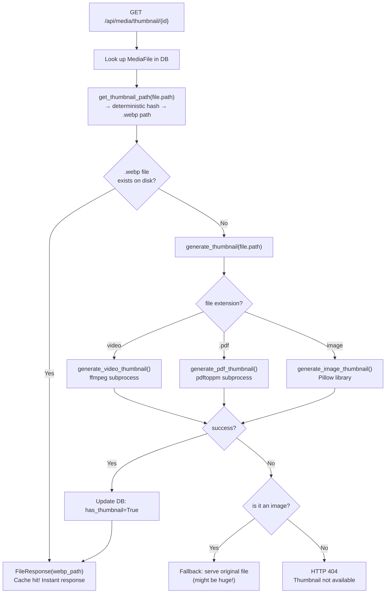

# 06 — Thumbnail Pipeline

Thumbnails are the small preview images you see in the timeline grid. Generating them is one of the most resource-intensive operations in Synaps.

**File**: `backend/thumbnails.py`

---

## Why Thumbnails?

Your original photos might be 5–50MB each. Loading 80 full-size photos to render a grid would:
- Use gigabytes of bandwidth
- Take minutes to load
- Crash the browser tab

Instead, Synaps generates a tiny (320×320 max) WebP preview for each file. WebP is ~30% smaller than JPEG at the same quality.

---

## The Cache-First Architecture

Every thumbnail request follows this flow:



---

## How Thumbnail Filenames Are Determined

```python
def get_thumbnail_path(file_path: str) -> str:
    path_hash = hashlib.md5(file_path.encode()).hexdigest()
    return os.path.join(THUMBNAIL_DIR, f"{path_hash}.webp")
```

**Example:**
- Input: `/storage/Vault/Harsh/Iphone/2024/01/IMG_4532.HEIC`
- MD5 of that string: `a3f7b9c2d4e5f6a7b8c9d0e1f2a3b4c5`
- Thumbnail path: `backend/thumbnails/a3f7b9c2d4e5f6a7b8c9d0e1f2a3b4c5.webp`

This is purely based on the file's **path string** (not content). This means:
- If you move the file, the thumbnail is effectively "orphaned" — a new thumbnail will be generated for the new path
- If you rename the file, same thing
- If the file content changes but the path stays the same, the old thumbnail remains cached

---

## Image Thumbnail Generation

```python
def generate_image_thumbnail(source_path, thumb_path):
    with Image.open(source_path) as img:
        if img.mode in ('RGBA', 'LA', 'P'):
            img = img.convert('RGB')      # WebP without alpha
        img.thumbnail(THUMBNAIL_SIZE, Image.LANCZOS)
        img.save(thumb_path, "WEBP", quality=75, optimize=True)
```

### `img.thumbnail(THUMBNAIL_SIZE, Image.LANCZOS)`

`THUMBNAIL_SIZE = (320, 320)` — this is the max size. The image is scaled to fit within this box while preserving aspect ratio:
- A 4032×3024 photo (4:3) → 320×240
- A 1170×2532 iPhone portrait → 148×320
- A 3024×3024 square → 320×320

`Image.LANCZOS` is a high-quality downsampling algorithm — produces sharp thumbnails. The alternative `Image.BILINEAR` is faster but slightly blurry.

### Mode Conversion

Some image modes can't be saved directly as WebP:
- `RGBA` → has transparency → convert to `RGB` (remove transparency)
- `LA` → grayscale + alpha → convert to `RGB`
- `P` → palette-based (like old GIFs) → convert to `RGB`

### HEIC Support

HEIC (Apple's photo format) is supported via `pillow-heif`:
```python
try:
    from pillow_heif import register_heif_opener
    register_heif_opener()  # Registers HEIC as a Pillow-openable format
    HAS_HEIF = True
except ImportError:
    HAS_HEIF = False
    logger.warning("pillow-heif not installed — HEIC thumbnails disabled")
```

When HEIC support is enabled, `Image.open("file.heic")` just works. When it's not, `Image.open("file.heic")` raises `UnidentifiedImageError`, which is caught and logged.

**How to install HEIC support:**
```bash
pip install pillow-heif
```

Note: On some Linux ARM systems (older NAS), `pillow-heif` may fail to compile. In that case, HEIC thumbnails will always show the extension text fallback.

---

## Video Thumbnail Generation

Videos require ffmpeg — an external command-line tool that cannot be done via Python alone:

```python
def generate_video_thumbnail(source_path, thumb_path):
    result = subprocess.run([
        "ffmpeg", "-y",
        "-ss", "0.5",                    # Seek to 0.5 seconds
        "-i", source_path,               # Input file
        "-vframes", "1",                 # Extract exactly 1 frame
        "-vf", f"scale={THUMBNAIL_SIZE[0]}:-1",  # Scale to 320px wide
        "-q:v", "5",                     # Quality level (1=best, 31=worst)
        "-loglevel", "error",            # Only show errors
        thumb_path                       # Output file
    ],
    capture_output=True,
    timeout=30,        # Kill ffmpeg if it hangs > 30 seconds
    )
```

**The two-attempt strategy:**
1. First attempt: seek to 0.5 seconds, extract frame
2. If that fails (very short video < 0.5s): try without seeking, get first frame

**Why `-ss 0.5` before `-i`?**
Placing `-ss` before `-i` uses keyframe seeking (fast). Placing it after `-i` is more accurate but much slower. For thumbnails, keyframe seeking is fine.

**`timeout=30`**: Protects against hung ffmpeg processes on corrupt video files. After 30 seconds, the subprocess is killed.

**Why `capture_output=True`?**
Without this, ffmpeg's verbose output would flood the terminal. With this, all output goes to `result.stdout` and `result.stderr` (which we ignore since `-loglevel error` suppresses most output).

---

## PDF Thumbnail Generation

PDFs use `pdftoppm` (from the `poppler-utils` package):

```python
def generate_pdf_thumbnail(source_path, thumb_path):
    temp_path = thumb_path.replace('.webp', '_temp.png')
    result = subprocess.run([
        "pdftoppm",
        "-png", "-f", "1", "-l", "1",  # PNG format, pages 1 to 1 (first page only)
        "-scale-to", str(THUMBNAIL_SIZE[0]),  # Scale to 320px
        source_path,
        temp_path.replace('.png', '')   # Output prefix (pdftoppm adds -01.png)
    ], ...)
    
    # pdftoppm creates file with -01 suffix
    actual_temp = temp_path.replace('.png', '-01.png')
    if not os.path.exists(actual_temp):
        actual_temp = temp_path.replace('.png', '-1.png')   # Some versions use -1
    
    if os.path.exists(actual_temp):
        with Image.open(actual_temp) as img:
            img.thumbnail(THUMBNAIL_SIZE, Image.LANCZOS)
            img.save(thumb_path, "WEBP", quality=75)
        os.remove(actual_temp)  # Clean up temp file
```

The suffix inconsistency (`-01.png` vs `-1.png`) is a known issue with different `pdftoppm` versions — the code handles both.

---

## Why HEIC/Video/PDF Thumbnails Fail

Here's a diagnosis table:

| File Type | Common Failure Reason | Log Message | Fix |
|-----------|----------------------|-------------|-----|
| HEIC | `pillow-heif` not installed | `pillow-heif not installed — HEIC thumbnails disabled` | `pip install pillow-heif` |
| HEIC | LibHeif not available on ARM | `OSError: No such file or directory` | Install `libheif-dev` system package first |
| MP4/MOV | `ffmpeg` not installed | `ffmpeg not found` | `sudo apt install ffmpeg` |
| Video | File corrupt/timeout | `Video thumbnail timed out` | Check the specific file |
| PDF | `poppler-utils` not installed | `pdftoppm not found` | `sudo apt install poppler-utils` |
| PDF | Encrypted PDF | pdftoppm returns non-zero | Decrypt PDF first |
| PNG with transparency | Mode P error | Usually silent, handled | Code converts mode |

---

## Thumbnail Storage

Thumbnails are stored in `backend/thumbnails/`. Each is a `.webp` file named by the MD5 hash of the source path.

```
backend/thumbnails/
├── a3f7b9c2d4e5f6a7.webp   (320×240, ~15KB)
├── b4c5d6e7f8a9b0c1.webp   (150×320, ~12KB)
├── c5d6e7f8a9b0c1d2.webp   (320×320, ~18KB)
└── ...
```

**Size estimate**: For 1,000 photos, thumbnails total ≈ 15–30MB. For 10,000 photos ≈ 150–300MB. This is manageable even on a small NAS.

**Clearing the cache**: To regenerate all thumbnails, simply delete all `.webp` files:
```bash
rm backend/thumbnails/*.webp
```

The next time each thumbnail is requested, it will be regenerated.

---

## `batch_generate_thumbnails()` — Bulk Generation

```python
def batch_generate_thumbnails(file_paths, db_session=None):
    stats = {"generated": 0, "cached": 0, "failed": 0}
    for path in file_paths:
        thumb_path = get_thumbnail_path(path)
        if os.path.exists(thumb_path):
            stats["cached"] += 1
            continue
        result = generate_thumbnail(path)
        if result:
            stats["generated"] += 1
            if db_session:
                # Update DB has_thumbnail flag
                media = db_session.query(MediaFile).filter(...).first()
                if media:
                    media.has_thumbnail = True
    ...
```

This function exists but is **NOT currently called anywhere**. It's prepared for a future "pre-generate all thumbnails" background task.

Currently, all thumbnail generation is purely **on-demand** — triggered only when a browser requests a specific thumbnail URL.

---

## Performance on Low-End Hardware

### Core2Duo NAS (1.6–2.0 GHz, ~2GB RAM)

| Thumbnail Type | CPU Time | Notes |
|----------------|----------|-------|
| JPEG (320×320) | ~50–200ms | Fast, Pillow is efficient |
| PNG (4MB) | ~100–300ms | Depends on compression |
| HEIC (12MP) | ~500ms–2s | HEIC decoding is heavy |
| MP4 (via ffmpeg) | ~500ms–3s | ffmpeg uses hardware if available |
| MOV (iPhone, HEVC) | ~2–5s | HEVC is CPU-intensive |

### Recommendations for Slow NAS

1. **Only generate thumbnails when needed** — the current lazy approach is correct for slow hardware.

2. **Keep `THUMBNAIL_QUALITY = 75`** — already set appropriately. Lower quality = smaller files + faster encoding.

3. **Keep `THUMBNAIL_SIZE = (320, 320)`** — already at a good balance. Smaller (e.g., 240×240) would be faster but look blurry in the grid.

4. **Limit concurrent thumbnail generation**: `MAX_CONCURRENT_THUMBNAILS = 2` is set in config but not actually enforced anywhere. If 10 browser tabs are open all requesting thumbnails simultaneously, all 10 requests will hit the backend at once. A proper queue/semaphore would help here.

5. **Use a CDN or nginx for static file serving**: Rather than having FastAPI serve thumbnail files (which uses Python overhead), configure nginx to serve the thumbnails directory directly. This frees up Python for actual computation.

---

## Potential Improvements

### Add a Pre-Generation Queue

```python
# This would be a much better architecture:
import asyncio

thumbnail_semaphore = asyncio.Semaphore(2)  # Max 2 at once

async def generate_thumbnail_async(path):
    async with thumbnail_semaphore:
        # Run generation in a thread pool (it's CPU-bound, not I/O-bound)
        loop = asyncio.get_event_loop()
        result = await loop.run_in_executor(None, generate_thumbnail, path)
        return result
```

### Add Progress Reporting

Currently there's no way to know how many thumbnails are pending. A websocket endpoint that broadcasts thumbnail generation progress would significantly improve the UX.

### Implement Hardware-Accelerated Video Decoding

On systems with compatible GPUs (even old NVidia cards):
```bash
ffmpeg -hwaccel auto -ss 0.5 -i video.mp4 ...
```

This can be 5–10x faster for video thumbnail extraction.
