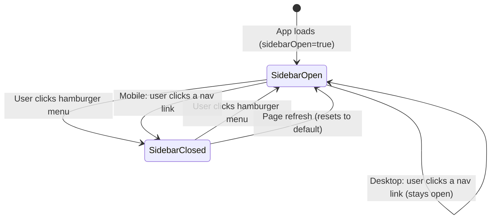

# 08 — Routing and Navigation

Understanding how navigation works in Synaps is critical to debugging "broken page" issues.

---

## How Next.js App Router Works (Simple Explanation)

Imagine every folder inside `src/app/` is a room in a building, and the URL is the room address.

```
src/app/
├── page.tsx          → "Room /"      — the main lobby (Timeline)
├── finder/
│   └── page.tsx      → "Room /finder"  — the file browser
├── search/
│   └── page.tsx      → "Room /search"  — the search page
├── sync/
│   └── page.tsx      → "Room /sync"    — the upload page
├── trash/
│   └── page.tsx      → "Room /trash"   — the trash page
└── settings/
    └── page.tsx      → "Room /settings" — the settings page
```

`layout.tsx` is like the building's hallways and common areas — it wraps every room.

---

## The Navigation Stack

When you click "Finder" in the sidebar, here's the full chain:

```mermaid
sequenceDiagram
    participant User
    participant Sidebar as Sidebar.tsx
    participant Link as Next.js <Link>
    participant Router as Next.js Router
    participant Layout as layout.tsx + AppShell
    participant Page as finder/page.tsx

    User->>Sidebar: Clicks "Finder" nav item
    Sidebar->>Link: href="/finder" onClick fires
    Sidebar->>Sidebar: if mobile, setSidebarOpen(false)
    Link->>Router: Client-side navigation to /finder
    Router->>Layout: layout.tsx stays mounted (NOT re-rendered)
    Router->>Page: Unmounts current page.tsx, mounts finder/page.tsx
    Page->>Page: useEffect fires → browseDirectory('')
    Page-->>User: Finder UI appears
```

**Key point**: `layout.tsx` (and therefore `AppShell`, `Sidebar`, `MediaViewer`) **never unmounts** during navigation. Only the content area (`{children}`) changes. This is why the sidebar state persists across page navigations.

---

## The `<Link>` Component

Next.js's `<Link>` is not a regular HTML `<a>` tag. It does:
- **Prefetching**: On hover, it starts loading the destination page in the background
- **Client-side navigation**: No full page reload — React just swaps the components
- **History management**: Browser back/forward buttons work correctly

```tsx
// In Sidebar.tsx
import Link from 'next/link';

<Link href="/finder" onClick={() => { if (mobile) setSidebarOpen(false); }}>
  Finder
</Link>
```

---

## Active State Detection

The sidebar highlights the current page:

```tsx
// Sidebar.tsx
const pathname = usePathname();   // e.g., "/finder"

const isActive = pathname === item.href;
// For '/finder': isActive = ("/finder" === "/finder") = true
// For '/': isActive = ("/finder" === "/") = false
```

`usePathname()` is a React hook from `next/navigation` that returns the current URL path. It updates automatically on navigation without a page reload.

---

## Why Sidebar Navigation Can Break

Here are every known failure mode for navigation:

### Problem 1: Sidebar Not Visible

**Symptom**: No sidebar at all, just blank page content.

**Root cause**: `sidebarOpen` is `false` in the Zustand store.

The `Sidebar` component is inside `<AnimatePresence>` with a conditional:
```tsx
<AnimatePresence>
  {sidebarOpen && (
    <motion.aside>...</motion.aside>
  )}
</AnimatePresence>
```

When `sidebarOpen = false`, the entire `<motion.aside>` is **unmounted** — completely removed from the DOM. The navigation links don't exist on the page at all.

**How to debug**:
1. Open browser DevTools → Console tab
2. Run: `window.__zustand__` (if available) or look at React DevTools
3. Check the `sidebarOpen` value in the store

**How to fix**:
- Click the hamburger menu (☰) in TopBar to toggle it
- The state resets to `true` on page refresh (default value in store.ts)

### Problem 2: Sidebar Visible But Navigation Not Working

**Symptom**: You can see the sidebar, but clicking links does nothing or causes a full page reload.

**Possible causes**:

1. **JavaScript error in the component tree**: If an unhandled error occurs, React may stop rendering the component tree. Check the browser console for red error messages.

2. **`<Link>` replaced with `<a>` by mistake**: Regular `<a href="/finder">` causes a full page reload. Only `<Link href="/finder">` does client-side navigation.

3. **Next.js not running**: If the frontend server crashed, the page is serving stale HTML from a previous build. Navigation links may work for regular anchors but not Next.js routing.

### Problem 3: Active Highlight Shows Wrong Item

**Symptom**: Timeline is active, but "Finder" is highlighted.

**Cause**: `usePathname()` returning unexpected value.

Check what pathname is being returned:
```tsx
// Temporary debug code in Sidebar.tsx
console.log('Current pathname:', pathname);
```

On the root page, `pathname` should be exactly `"/"`. If it's `"/index"` or empty, there's a routing configuration issue.

### Problem 4: Filter Clicks Not Updating Timeline

**Symptom**: Clicking "Photos" or "Videos" in the sidebar doesn't change the timeline.

**Root cause**: The filter buttons don't navigate — they update global state:
```tsx
// Sidebar.tsx
<button onClick={() => setFilter(f.key)}>Photos</button>
```

`setFilter` calls `setActiveFilter` in the Zustand store. The Timeline page reads this:
```tsx
// page.tsx (Timeline)
const { activeFilter } = useAppStore();

useEffect(() => {
  fetchPage(1, true);  // Resets and fetches with new filter
}, [activeFilter]);    // Runs when activeFilter changes
```

If the Timeline page isn't subscribed to `activeFilter` (e.g., if you're on `/finder`), clicking filters does nothing visible. Filters only work on the Timeline page.

**This is intentional** — filters are a timeline-only feature, not a global navigation state.

---

## The Sidebar State Machine



The breakpoint for "mobile" vs "desktop" is 1024px (`lg:` in Tailwind). The sidebar uses different CSS:
- Mobile: `fixed` positioning (overlaps content), closes on nav click
- Desktop (`lg:`): `z-30` (lower z-index), main content shifts right with `lg:ml-[260px]`

---

## Route Transitions

Synaps doesn't implement explicit page transition animations. Each page's components use Framer Motion's `initial`/`animate` props to fade in:

```tsx
// settings/page.tsx
<motion.section
  initial={{ opacity: 0, y: 20 }}
  animate={{ opacity: 1, y: 0 }}
>
```

When you navigate to Settings, the sections animate from below. This gives the feeling of a transition without a dedicated transition wrapper.

---

## URL Structure on the NAS

In development, URLs are:
- Frontend: `http://localhost:3000/finder`
- Backend: `http://localhost:8000/api/finder/browse`

On the NAS with production build:
- Frontend: `http://NAS-IP:3000/finder`
- Backend: `http://NAS-IP:8000/api/finder/browse`
- (Users access frontend; Next.js proxies to backend automatically)

The proxy rewrite in `next.config.js`:
```js
source: '/api/:path*',
destination: 'http://localhost:8000/api/:path*',
```

Note `localhost` in the destination — this means the proxy connects to the backend on the same machine. If you ever run frontend on a different machine than the backend, this would need to change to the actual backend IP.

---

## Debugging Navigation Step by Step

**Step 1**: Is the frontend running?
```bash
curl http://localhost:3000
# Should return HTML (not "connection refused")
```

**Step 2**: Is the backend running?
```bash
curl http://localhost:8000/api/health
# Should return {"status": "ok"}
```

**Step 3**: Does the proxy work?
```bash
curl http://localhost:3000/api/health
# Should also return {"status": "ok"} — goes through Next.js proxy
```

**Step 4**: Is the sidebar visible? (Check the Store)
- Open browser DevTools → Components tab (React DevTools extension required)
- Find `AppShell` → check `sidebarOpen` prop

**Step 5**: Do links exist in the DOM?
- Press F12 → Elements tab
- Search for `href="/finder"` 
- If it exists, the link is rendered; if not, the sidebar isn't mounted

**Step 6**: Check for JavaScript errors
- Console tab → any red errors?
- Network tab → any failed requests (red rows)?

---

## How to Add a New Page

If you want to add a new page (e.g., `/albums`):

1. Create `frontend/src/app/albums/page.tsx`:
```tsx
'use client';

import { TopBar } from '@/components/TopBar';

export default function AlbumsPage() {
  return (
    <div className="min-h-screen">
      <TopBar title="Albums" />
      <div className="px-4 py-6">
        {/* Page content here */}
      </div>
    </div>
  );
}
```

2. Add to Sidebar navigation in `Sidebar.tsx`:
```tsx
const navItems = [
  ...existing items...,
  { href: '/albums', label: 'Albums', icon: BookImage },
];
```

That's it! Next.js App Router automatically registers the route from the folder structure. No router configuration needed.
