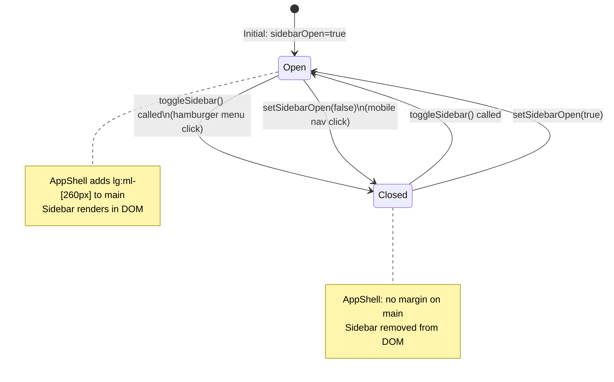
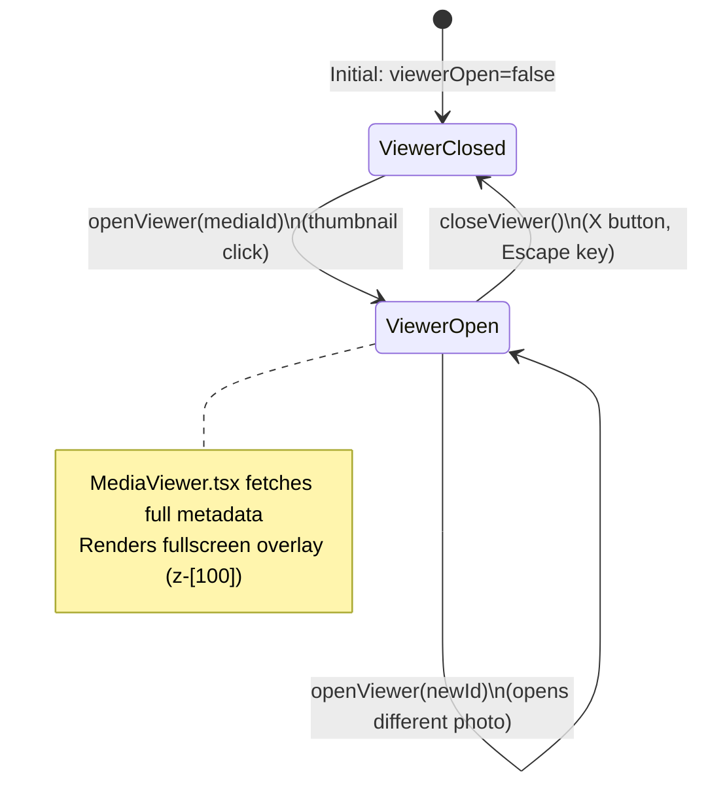
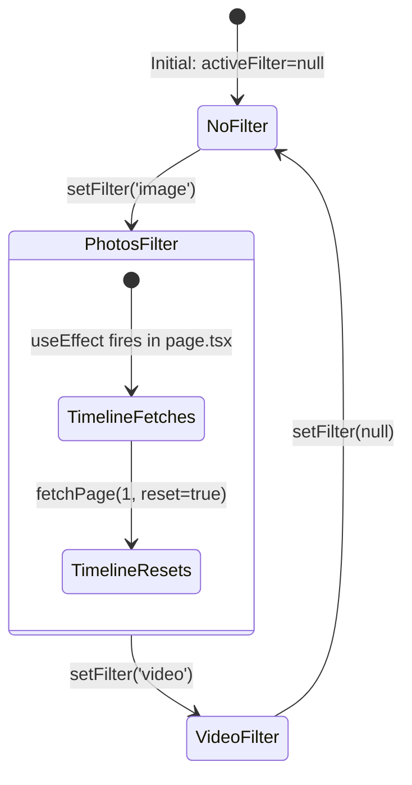

# 09 — State Management

State management is how the app remembers things and keeps different components in sync. In Synaps, state lives in two places: **React local state** (inside individual components) and **Zustand global state** (shared across all components).

---

## Two Types of State

### 1. Local State (`useState`)

Lives inside one component. Other components can't see it.

```tsx
// Only the Timeline page knows about these:
const [groups, setGroups] = useState<TimelineGroup[]>([]);
const [loading, setLoading] = useState(true);
const [page, setPage] = useState(1);
```

### 2. Global State (Zustand)

Shared across ALL components. Any component can read or update it.

```tsx
// Any component can read these:
const { sidebarOpen, activeFilter, viewerOpen, viewerMediaId } = useAppStore();
```

---

## The Zustand Store — `src/lib/store.ts`

```typescript
interface AppState {
  // Values
  theme: 'light' | 'dark' | 'system';
  sidebarOpen: boolean;
  viewerOpen: boolean;
  viewerMediaId: string | null;
  activeFilter: string | null;
  searchQuery: string;

  // Actions (functions that update values)
  setTheme: (theme) => void;
  toggleSidebar: () => void;
  setSidebarOpen: (open) => void;
  openViewer: (mediaId) => void;
  closeViewer: () => void;
  setFilter: (filter) => void;
  setSearchQuery: (query) => void;
}
```

### Initial Values

| State | Default | Meaning |
|-------|---------|---------|
| `theme` | `'dark'` | Start in dark mode |
| `sidebarOpen` | `true` | Sidebar visible on load |
| `viewerOpen` | `false` | Viewer closed on load |
| `viewerMediaId` | `null` | No photo selected |
| `activeFilter` | `null` | Show all media (no filter) |
| `searchQuery` | `''` | Empty search |

**Important**: Zustand state is in-memory only. A page refresh resets everything to these defaults.

### How State Updates Work

```tsx
// Store implementation:
toggleSidebar: () => set((s) => ({ sidebarOpen: !s.sidebarOpen })),
```

`set` is Zustand's update function. It does a **shallow merge** — you only specify what changed:
```tsx
set({ sidebarOpen: false })
// Equivalent to: { ...currentState, sidebarOpen: false }
```

When any value changes, Zustand notifies every component that reads that value to re-render.

---

## State Flow Diagrams

### Sidebar State



### Viewer State



### Filter State



---

## Timeline Page State In Detail

The Timeline page (`page.tsx`) has the most complex state in the entire app:

```tsx
// Simple state (single values):
const [groups, setGroups] = useState<TimelineGroup[]>([]);
const [loading, setLoading] = useState(true);
const [loadingMore, setLoadingMore] = useState(false);
const [page, setPage] = useState(1);
const [hasMore, setHasMore] = useState(true);
const [stats, setStats] = useState<any>(null);
const [collapsedGroups, setCollapsedGroups] = useState<Set<string>>(new Set());

// Ref (persists across renders without causing re-renders):
const loadedIdsRef = useRef<Set<string>>(new Set());
```

### Why `useRef` for `loadedIdsRef`?

`useRef` is like a variable that:
- Persists across re-renders (doesn't reset when state changes)
- Does NOT cause a re-render when it changes
- Is accessed via `.current`

Using `useState` instead would cause extra re-renders: every time we add an ID to the dedup set, the component would re-render unnecessarily.

```tsx
// This is a ref — changing it does NOT re-render:
loadedIdsRef.current = new Set();          // Reset
loadedIdsRef.current.add(item.id);         // Track seen ID
if (loadedIdsRef.current.has(item.id)) {}  // Check
```

### The `groups` State Structure

```typescript
interface TimelineGroup {
  year: number;           // 2024
  month: number;          // 1
  month_name: string;     // "January"
  items: MediaItem[];     // Array of media objects from API
}

// groups is an array of these, sorted newest first:
groups = [
  { year: 2024, month: 5, month_name: "May", items: [...] },
  { year: 2024, month: 1, month_name: "January", items: [...] },
  { year: 2023, month: 12, month_name: "December", items: [...] },
]
```

### The `collapsedGroups` State

```tsx
// A Set of "year-month" keys
const [collapsedGroups, setCollapsedGroups] = useState<Set<string>>(new Set());

const toggleGroup = (key: string) => {
  setCollapsedGroups(prev => {
    const next = new Set(prev);       // Always create NEW set (immutability)
    if (next.has(key)) next.delete(key);  // Toggle collapse
    else next.add(key);
    return next;
  });
};
```

A `Set` is like an array but with no duplicates and O(1) lookup. The keys are strings like `"2024-1"` for January 2024.

**Why immutability matters**: React uses reference equality to detect changes. If you modified the existing Set (`prev.add(key)`) and returned it, React would see the same object reference and NOT re-render. By creating a `new Set(prev)`, you give React a new object reference, triggering a re-render.

---

## The `fetchPage` Merge Logic — Potential Bug Analysis

This is where the most subtle state bug lives.

```tsx
} else {
  // Append — merge into existing groups
  setGroups(prev => {
    const merged = prev.map(g => ({ ...g, items: [...g.items] }));   // Deep clone
    
    for (const group of data.groups) {
      const key = `${group.year}-${group.month}`;
      const existing = merged.find(g => `${g.year}-${g.month}` === key);
      
      const newItems = group.items.filter(item => {
        if (loadedIdsRef.current.has(item.id)) return false;
        loadedIdsRef.current.add(item.id);
        return true;
      });
      
      if (existing) {
        existing.items.push(...newItems);     // Add to existing month group
      } else if (newItems.length > 0) {
        merged.push({ ...group, items: newItems });  // Add new month group
      }
    }
    
    // Sort descending
    merged.sort((a, b) => {
      if (a.year !== b.year) return b.year - a.year;
      return b.month - a.month;
    });
    return merged;
  });
}
```

### Why `prev.map(g => ({ ...g, items: [...g.items] }))`?

This is a deep clone of the groups array. Without it:
1. `merged` would reference the same arrays as `prev`
2. `existing.items.push(...)` would mutate the state directly
3. React wouldn't detect the change → no re-render

The spread operator (`[...g.items]`) creates a new array with the same items — now we can safely modify it.

### Potential Timing Bug

```tsx
const newItems = group.items.filter(item => {
  if (loadedIdsRef.current.has(item.id)) return false;
  loadedIdsRef.current.add(item.id);
  return true;
});
```

This code mutates `loadedIdsRef.current` inside a `setGroups` callback. React may batch state updates and call this callback multiple times or in a different order than expected. The ref mutation is safe because refs don't cause re-renders, but the timing means `loadedIdsRef.current` could theoretically have been modified between the closure capturing it and the callback running.

In practice, this doesn't cause observable bugs, but it's a design smell.

---

## State Bugs and Issues

### Bug 1: Filter Active on Non-Timeline Pages

When you're on `/finder` and click "Photos" in the sidebar, `activeFilter` is set to `'image'`. When you navigate back to `/`, the Timeline page initializes with `activeFilter = 'image'` and shows only photos.

This is actually intended behavior — the filter persists. But it might surprise users who expect "All Media" when returning to the timeline.

**How to fix**: Add `setFilter(null)` when navigating to the home page, or show a clear visual indicator that a filter is active.

### Bug 2: No Persistence Across Refreshes

Every page refresh resets all state. This means:
- Your collapsed month groups reset
- Active filter resets
- Sidebar re-opens

For a NAS app, this is probably fine. But if you want persistence, add Zustand's `persist` middleware:
```tsx
import { persist } from 'zustand/middleware';

export const useAppStore = create(
  persist<AppState>(
    (set) => ({ ...defaultState }),
    { name: 'synaps-store' }   // Key in localStorage
  )
);
```

### Bug 3: Multiple Scan Triggers Not Coordinated

If the user clicks "Rescan Now" multiple times quickly, multiple background threads are spawned. Each one tries to insert new files. The `path UNIQUE` constraint prevents actual duplicate rows, but multiple concurrent scans waste CPU on a weak NAS.

**Fix**: Track scan state in the backend and reject new scan requests while one is running.

### Bug 4: `stats` Not Refreshed After Scan

The timeline subtitle ("347 items · 2.0 GB") is fetched once on mount:
```tsx
useEffect(() => {
  getMediaStats().then(setStats).catch(console.error);
}, []);   // [] = runs once only
```

After a rescan adds new photos, the stats don't update until you reload the page.

**Fix**: Refresh stats after `activeFilter` changes (which also triggers a timeline reload):
```tsx
useEffect(() => {
  setPage(1);
  setGroups([]);
  setHasMore(true);
  fetchPage(1, true);
  getMediaStats().then(setStats);  // ← add this
}, [activeFilter]);
```

---

## MediaViewer State

The MediaViewer has its own local state:

```tsx
const [media, setMedia] = useState<any>(null);   // Full media metadata
const [loading, setLoading] = useState(false);   // Fetching metadata?
const [showInfo, setShowInfo] = useState(false); // Info panel open?
const [zoom, setZoom] = useState(1);             // Zoom level (0.5x - 5x)
```

These reset every time the viewer opens a new photo (when `viewerMediaId` changes in the global store):
```tsx
useEffect(() => {
  if (viewerMediaId) {
    setLoading(true);
    setZoom(1);             // Always reset zoom to 1x
    setShowInfo(false);     // Always close info panel
    getMediaItem(viewerMediaId).then(setMedia)...
  }
}, [viewerMediaId]);
```

### How Favorite Toggle Works

```tsx
const handleFavorite = async () => {
  if (!media) return;
  const result = await toggleFavorite(media.id);      // API call
  setMedia({ ...media, is_favorite: result.is_favorite }); // Update local state
};
```

This updates the MediaViewer's local state immediately. **But the thumbnail in the grid still shows the old state** (without/with the star icon) until the page refreshes or the filter changes. This is an optimistic update that's only partially applied.

**Fix**: After toggling, update the `groups` state in the timeline to reflect the new `is_favorite` value. This would require the global store to hold the groups, or a callback function.

---

## Finder Page State

The Finder has simple state — no complex merging:

```tsx
const [currentPath, setCurrentPath] = useState('');    // Current directory
const [data, setData] = useState<any>(null);            // API response (folders + files)
const [loading, setLoading] = useState(true);
const [error, setError] = useState<string | null>(null);
```

Every navigation is a complete replacement (not a merge):
```tsx
const navigate = async (path) => {
  setCurrentPath(path);
  setLoading(true);
  setError(null);
  const result = await browseDirectory(path);
  setData(result);      // Complete replace, not merge
  setLoading(false);
};
```

---

## Search Page State

```tsx
const [query, setQuery] = useState('');
const [results, setResults] = useState<any[]>([]);
const [suggestions, setSuggestions] = useState({ files: [], directories: [] });
const [loading, setLoading] = useState(false);
const [total, setTotal] = useState(0);
const [filter, setFilter] = useState<string | null>(null);
const [showSuggestions, setShowSuggestions] = useState(false);
```

The search page has its own local `filter` state (separate from the global `activeFilter`). This is intentional — search has its own type filter (Photos / Videos / Docs) that's independent from the Timeline filter.

---

## State Debugging Tools

### React DevTools

Install the browser extension "React Developer Tools". Then:
1. Open DevTools → "Components" tab
2. Click any component in the tree
3. See its props and state on the right

### Zustand DevTools

Add this to `store.ts` to see state changes in Redux DevTools:
```tsx
import { devtools } from 'zustand/middleware';

export const useAppStore = create<AppState>(
  devtools(
    (set) => ({ ...store }),
    { name: 'SynapsStore' }
  )
);
```

### Console Debugging

Quick way to inspect state from the browser console:
```javascript
// React doesn't expose state directly, but you can add temp logging:
// In any component:
console.log('groups:', groups, 'loading:', loading);
```
