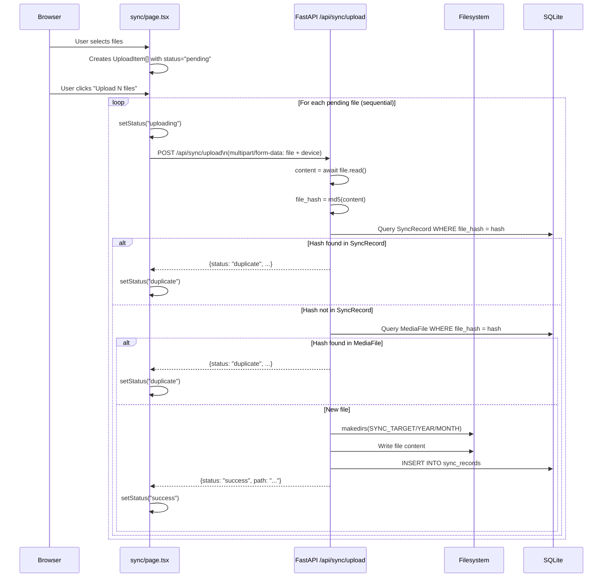
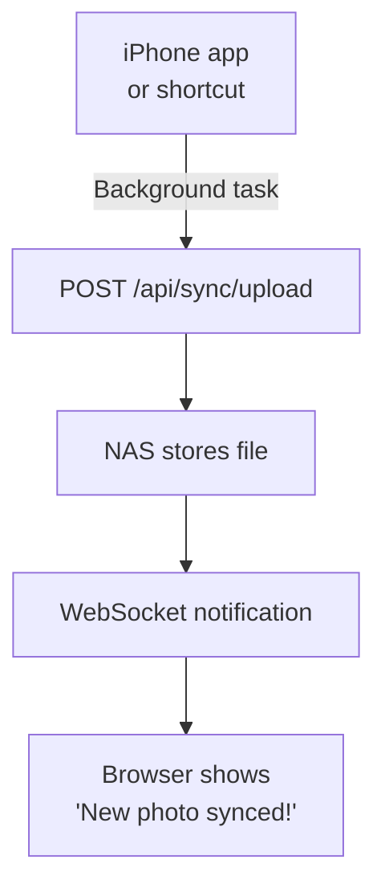

# 10 — Sync Engine

The Sync Engine is the upload pipeline that allows you to send files from your iPhone (or any device) to the NAS.

**Files**: `backend/routers/sync.py` + `frontend/src/app/sync/page.tsx`

---

## What the Sync Engine Does

1. Accepts file uploads via HTTP POST
2. Computes an MD5 hash of the uploaded file content
3. Checks if the file was already uploaded (by hash) → rejects duplicates
4. Organizes the file into a `YEAR/MONTH` folder structure
5. Saves a `SyncRecord` to the database for future deduplication

---

## Upload Flow (Single File)



---

## File Organization System

Uploaded files are organized into this structure:
```
SYNC_TARGET_DIR/          ← config.py: STORAGE_PATH/Vault/Harsh/Iphone
  2024/
    01/                   ← January 2024
      IMG_4532.HEIC
      IMG_4533.HEIC
    02/                   ← February 2024
      IMG_4600.HEIC
  2026/
    05/                   ← May 2026 (current month)
      my_photo.jpg
```

The year/month comes from the **current date at time of upload**, not from the photo's EXIF date. This means if you upload a photo taken in 2022 in May 2026, it goes into the `2026/05/` folder.

**Pros**: Predictable location — all uploads from this month are in this month's folder.  
**Cons**: The folder structure doesn't match the photo's actual date. The timeline shows correct dates (from EXIF), but Finder shows them by upload date.

---

## Collision Handling

If a file with the same name already exists:
```python
dest_path = os.path.join(year_month_dir, file.filename)
counter = 1
base_name, ext_part = os.path.splitext(file.filename)
while os.path.exists(dest_path):
    dest_path = os.path.join(year_month_dir, f"{base_name}_{counter}{ext_part}")
    counter += 1
```

Example: Uploading `IMG_4532.HEIC` when it already exists:
- Try: `IMG_4532.HEIC` → exists
- Try: `IMG_4532_1.HEIC` → exists
- Try: `IMG_4532_2.HEIC` → doesn't exist → save here

---

## Duplicate Detection — How It Works

### Two-Layer Deduplication

**Layer 1: SyncRecord table**
Tracks every file previously uploaded via the Sync page.
```python
existing = db.query(SyncRecord).filter(SyncRecord.file_hash == file_hash).first()
if existing:
    return {"status": "duplicate", "message": f"Already synced as {existing.filename}"}
```

**Layer 2: MediaFile table**
Tracks every file the scanner has indexed (including files not uploaded through Sync).
```python
existing_media = db.query(MediaFile).filter(MediaFile.file_hash == file_hash).first()
if existing_media:
    return {"status": "duplicate", "message": f"Already exists as {existing_media.filename}"}
```

### The Hash Mismatch Problem

The **scanner** uses a partial hash (first 64KB):
```python
# scanner.py
data = f.read(65536)  # 64KB only
hasher.update(data)
```

The **upload** uses a full-content hash:
```python
# sync.py
content = await file.read()  # Entire file
file_hash = hashlib.md5(content).hexdigest()
```

For files larger than 64KB (basically all photos), these hashes will be different even for the same file. This means:

- Photo exists on NAS, scanned → stored in `MediaFile` with partial hash `abc123`
- Same photo uploaded via Sync → full hash is `xyz789`
- `xyz789` not found in SyncRecord or MediaFile → file is uploaded as a "new" file

**This is a bug**: The same photo can be duplicated on disk if first scanned from an existing library, then re-uploaded via Sync.

**Fix**: Standardize the hash approach — use either full hash everywhere (slow for scanner) or partial hash everywhere (less accurate for upload dedup).

---

## Frontend Upload State Machine

Each file in the upload queue goes through these states:

```
pending → uploading → success
                   → duplicate
                   → error
```

```tsx
interface UploadItem {
  file: File;
  status: 'pending' | 'uploading' | 'success' | 'duplicate' | 'error';
  progress: number;    // 0, 50, or 100 (binary — no real progress tracking)
  message?: string;    // Server message (e.g., "Already synced as...")
}
```

**The "progress" field is fake**: Real upload progress would require tracking bytes sent, which would need either the `XMLHttpRequest` API (with `onprogress`) or custom streaming. The current code just jumps from 0 to 50% when upload starts, then to 100% when done.

---

## Sequential vs Parallel Uploads

The current implementation uploads files **one at a time** (sequential):

```tsx
// sync/page.tsx — startUpload()
for (let i = 0; i < uploads.length; i++) {
  if (uploads[i].status !== 'pending') continue;
  // ... upload uploads[i] (await)
  // ... only then move to i+1
}
```

**Why sequential?** 
- The NAS has limited RAM and CPU
- Parallel uploads (5+ files at once) would overwhelm a Core2Duo
- Sequential is simpler to implement and debug

**Downside**: If you have 100 photos to upload, each taking 2 seconds, total time is 200 seconds. Parallel upload of 3 at a time would take ~67 seconds.

**Future improvement**: Allow 2–3 concurrent uploads with a semaphore.

---

## The NAS Target Directory

```python
# config.py
SYNC_TARGET_DIR = os.path.join(STORAGE_PATH, "Vault", "Harsh", "Iphone")
```

This is also hardcoded in `config.py`. All uploads go to the iPhone vault regardless of the `device` form field sent during upload.

The `device` parameter is stored in `SyncRecord` but not used to route files to different directories.

**Future improvement**: Route files based on device:
```python
if device == "iPhone":
    target = os.path.join(STORAGE_PATH, "Vault", "Harsh", "Iphone")
elif device == "Mac":
    target = os.path.join(STORAGE_PATH, "Vault", "Harsh", "Mac")
```

---

## After Upload — What Happens to the Timeline?

After a file is successfully uploaded to the NAS:
1. It's in the correct folder
2. It's recorded in `SyncRecord`
3. **But it does NOT appear in the timeline yet**

The timeline only shows files in the `MediaFile` table. The scanner must run to pick up the newly uploaded file.

Currently, the Sync page does NOT trigger a rescan after uploads. The user must manually go to Settings → "Rescan Now", or wait for the next backend restart.

**Fix**: Add an automatic partial rescan after uploads:
```python
# After successful upload in sync.py:
# Trigger a rescan of just the year_month_dir
scan_directory(db)  # Or a targeted scan
```

---

## Security Considerations

### Path Traversal

The sync endpoint doesn't validate filenames before writing:
```python
dest_path = os.path.join(year_month_dir, file.filename)
```

If `file.filename` contained `../../../etc/cron.d/backdoor`, `os.path.join` would create a path outside the intended directory. On most systems, this is blocked by OS permissions, but it's still a security concern.

**Fix:**
```python
# Sanitize filename before using it
safe_filename = os.path.basename(file.filename)  # Strips directory components
dest_path = os.path.join(year_month_dir, safe_filename)
```

### No Authentication

There is no authentication. Anyone on your local network can upload files to your NAS via `POST /api/sync/upload`. Since Synaps is designed for local network only, this is an acceptable tradeoff for simplicity, but on a NAS accessible from the internet, this would be a critical vulnerability.

---

## Future Background Sync Architecture

The current sync model is **pull-based**: you manually select files and push them.

A better architecture for automatic phone backup would be **push-based**:



This would require:
1. A background agent on the iPhone (iOS Shortcuts or a dedicated app)
2. WebSocket support in the backend for real-time notifications
3. Better progress tracking for large batches

---

## Sync History

Every successful upload creates a `SyncRecord`. You can view these via:

```bash
# Backend API
curl http://localhost:8000/api/sync/history

# Direct database query
sqlite3 backend/synaps.db "SELECT filename, file_size, synced_at FROM sync_records ORDER BY synced_at DESC LIMIT 20;"
```
