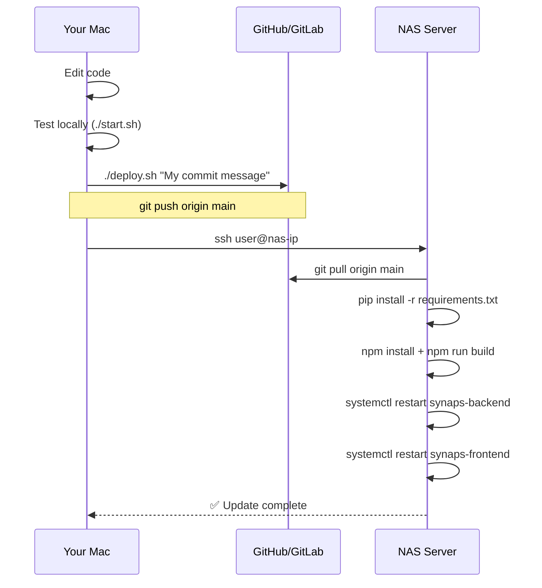

# 11 — Deployment and Services

This document covers how to deploy, update, and manage Synaps on your NAS in production.

---

## The Deployment Model

Synaps uses a **two-process** architecture in production:

```
Process 1: uvicorn (Python WSGI)
  └── Runs FastAPI backend on port 8000
  └── Handles all API requests, scans, thumbnails

Process 2: next start (Node.js)
  └── Runs Next.js frontend on port 3000
  └── Serves the UI and proxies API calls to port 8000
```

Both processes must be running for Synaps to work.

---

## Development Mode vs Production Mode

### Development Mode (`start.sh`)

```bash
#!/bin/bash
cd backend && source venv/bin/activate
python main.py &          # Uses uvicorn with --reload (auto-restart on code changes)

cd frontend
npm run dev &             # Next.js dev server (hot reload, slower, more RAM)
```

**Dev mode characteristics:**
- `python main.py` internally runs: `uvicorn main:app --host 0.0.0.0 --port 8000 --reload`
- `--reload` watches for Python file changes and auto-restarts the server
- `npm run dev` uses Next.js development server with source maps
- **More RAM usage** (dev builds are unoptimized)
- **Slower page loads** (no caching, larger JS bundles)
- Use this on your Mac when actively coding

### Production Mode (`start-prod.sh`)

```bash
#!/bin/bash
cd backend && source venv/bin/activate
uvicorn main:app --host 0.0.0.0 --port 8000 --workers 1 &

cd frontend
npm run start &            # Serves pre-built static files
```

**Production mode characteristics:**
- `--workers 1` (single worker — optimal for Core2Duo NAS with limited RAM)
- `npm run start` serves the pre-built Next.js app (you must run `npm run build` first)
- **Less RAM** (optimized bundles)
- **Faster page loads** (pre-built, cached)
- Use this on your NAS

---

## The Shell Scripts

### `deploy.sh` — Run on Your Mac

```bash
#!/bin/bash
git add .
COMMIT_MSG=${1:-"Update Synaps"}
git commit -m "$COMMIT_MSG" || echo "No changes to commit."
git push origin main
echo "Now SSH into your NAS and run ./update.sh"
```

**Usage:**
```bash
./deploy.sh "Fix thumbnail generation"
./deploy.sh   # Uses default message "Update Synaps"
```

This is the Git push step — it sends your local changes to GitHub/GitLab. It does NOT deploy to the NAS directly.

### `update.sh` — Run on Your NAS (via SSH)

```bash
#!/bin/bash
git pull origin main           # Pull latest code

cd backend
source venv/bin/activate
pip install -r requirements.txt  # Install any new Python packages

cd frontend
npm install                    # Install any new npm packages
npm run build                  # Build production-optimized frontend

# Restart services
if systemctl list-unit-files | grep -q synaps-backend; then
    sudo systemctl restart synaps-backend
    sudo systemctl restart synaps-frontend
else
    echo "Run ./start-prod.sh manually"
fi
```

**Usage (from your Mac):**
```bash
ssh user@nas-ip
cd /path/to/nas_dashboard
./update.sh
```

### `setup.sh` — Initial Setup (Run Once)

Not shown in the code above but exists in the project. Would handle:
- Creating Python virtual environment
- Installing Python dependencies
- Installing npm dependencies
- Building frontend for first time

---

## Deployment Workflow



---

## Setting Up systemd Services

For production, you want Synaps to:
- Start automatically when the NAS boots
- Restart automatically if it crashes

Here's how to set up systemd services on Ubuntu/Debian NAS:

### Backend Service

Create `/etc/systemd/system/synaps-backend.service`:

```ini
[Unit]
Description=Synaps Backend (FastAPI)
After=network.target

[Service]
Type=simple
User=YOUR_USERNAME
WorkingDirectory=/path/to/nas_dashboard/backend
ExecStart=/path/to/nas_dashboard/backend/venv/bin/uvicorn main:app --host 0.0.0.0 --port 8000 --workers 1
Restart=always
RestartSec=5
StandardOutput=journal
StandardError=journal

[Install]
WantedBy=multi-user.target
```

### Frontend Service

Create `/etc/systemd/system/synaps-frontend.service`:

```ini
[Unit]
Description=Synaps Frontend (Next.js)
After=network.target synaps-backend.service

[Service]
Type=simple
User=YOUR_USERNAME
WorkingDirectory=/path/to/nas_dashboard/frontend
ExecStart=/usr/bin/npm run start
Environment=NODE_ENV=production
Restart=always
RestartSec=5
StandardOutput=journal
StandardError=journal

[Install]
WantedBy=multi-user.target
```

### Enable and Start Services

```bash
sudo systemctl daemon-reload
sudo systemctl enable synaps-backend synaps-frontend
sudo systemctl start synaps-backend synaps-frontend

# Check status
sudo systemctl status synaps-backend
sudo systemctl status synaps-frontend
```

---

## Viewing Logs

### systemd logs (production):
```bash
# Backend logs (last 100 lines)
journalctl -u synaps-backend -n 100

# Frontend logs
journalctl -u synaps-frontend -n 100

# Follow live (like tail -f)
journalctl -u synaps-backend -f

# Since last boot
journalctl -u synaps-backend -b
```

### Direct output (dev mode):
When running `./start.sh`, logs go directly to your terminal. Prefix `[synaps]` is from the Python logger.

---

## The Build Step (`npm run build`)

This is a critical step that's often forgotten. **If you modify frontend code and deploy without rebuilding, your changes won't appear.**

```bash
# On the NAS, after git pull:
cd frontend
npm run build
```

What happens during build:
1. TypeScript is compiled → JavaScript
2. All pages are pre-rendered where possible
3. JavaScript bundles are optimized and minified
4. Files are output to `frontend/.next/` directory

The `.next/` directory contains the production artifacts. `npm run start` serves from there.

**Build time on Core2Duo NAS**: Expect 1–5 minutes. This is normal — Node.js compilation is CPU-intensive.

---

## Environment Variables

### Backend (`.env` in `backend/`)

```bash
# Storage - MUST be set for production NAS
SYNAPS_STORAGE_PATH=/storage

# Optional overrides
SYNAPS_DB_URL=sqlite:////path/to/synaps.db
SYNAPS_THUMBNAIL_DIR=/path/to/thumbnails
SYNAPS_TRASH_DIR=/path/to/trash
SYNAPS_HOST=0.0.0.0
SYNAPS_PORT=8000
```

For the NAS, the minimum required change is:
```bash
echo "SYNAPS_STORAGE_PATH=/storage" >> backend/.env
```

### Frontend

No environment variables are needed — the API URL is hardcoded as `localhost:8000` in `next.config.js`. If your backend ever moves to a different server, you'd need to update this:
```js
destination: 'http://BACKEND-IP:8000/api/:path*',
```

---

## Port Configuration

| Service | Port | Configurable? |
|---------|------|--------------|
| Backend (FastAPI) | 8000 | Yes, via `SYNAPS_PORT` env var |
| Frontend (Next.js) | 3000 | Yes, via `-p` flag in package.json scripts |

If you change ports, update:
1. `backend/.env` → `SYNAPS_PORT=XXXX`
2. `frontend/next.config.js` → `destination: 'http://localhost:XXXX/api/:path*'`
3. systemd service files (if using)

---

## Recommended Git Workflow

### Feature Branch Workflow

```bash
# Never code directly on main
git checkout -b feature/better-thumbnails

# Make changes, test locally
# ...

# Merge back to main when ready
git checkout main
git merge feature/better-thumbnails

# Deploy
./deploy.sh "Add better thumbnail support"
```

### Commit Message Convention

```bash
# Format: type: description
git commit -m "fix: scanner skipping HEIC files"
git commit -m "feat: add video duration display"
git commit -m "perf: reduce thumbnail size for faster loading"
git commit -m "docs: update API reference"
```

---

## Production-Grade Recommendations

### 1. Add nginx as a Reverse Proxy

Instead of exposing ports 3000 and 8000 directly, use nginx:

```nginx
# /etc/nginx/sites-enabled/synaps
server {
    listen 80;
    server_name nas.local;

    # Frontend
    location / {
        proxy_pass http://localhost:3000;
        proxy_set_header Host $host;
    }

    # Serve thumbnails directly (bypass Python)
    location /thumbnails/ {
        alias /path/to/nas_dashboard/backend/thumbnails/;
        expires 30d;
        add_header Cache-Control "public, immutable";
    }
}
```

Serving thumbnails via nginx is much faster than serving them via FastAPI — nginx is written in C and optimized for static file serving.

### 2. Add Health Check Monitoring

```bash
# Simple cron job to restart if backend crashes
# crontab -e
*/5 * * * * curl -s http://localhost:8000/api/health || systemctl restart synaps-backend
```

### 3. Database Backups

```bash
# Daily backup cron
0 3 * * * cp /path/to/backend/synaps.db /backup/synaps-$(date +%Y%m%d).db
# Keep last 7 days
find /backup/ -name "synaps-*.db" -mtime +7 -delete
```

### 4. Log Rotation

Long-running services accumulate lots of logs. Configure systemd log limits:
```ini
# In the [Service] section of your .service file:
StandardOutput=journal
StandardError=journal
SyslogIdentifier=synaps-backend
# systemd-journald handles rotation automatically
```

---

## Diagnosing Startup Problems

### Problem: Backend Won't Start

```bash
# Test manually:
cd backend && source venv/bin/activate
python main.py

# Look for errors like:
# - ModuleNotFoundError: No module named 'fastapi'
#   → pip install -r requirements.txt
# - sqlite3.OperationalError: unable to open database file
#   → Check write permissions on backend/ directory
# - Address already in use
#   → Something is already running on port 8000: lsof -i :8000
```

### Problem: Frontend Won't Start

```bash
# Test manually:
cd frontend
npm run build    # Must succeed first
npm run start

# Common errors:
# - Module not found
#   → npm install
# - EACCES: permission denied
#   → chown -R $(whoami) frontend/
# - Port 3000 already in use
#   → lsof -i :3000 | grep LISTEN
```

### Problem: API Calls Failing (404 or network error)

```bash
# Check backend is running:
curl http://localhost:8000/api/health

# Check proxy config:
# frontend/next.config.js should point to http://localhost:8000

# Check from browser:
# Open Network tab → look at the failing /api/... request
# Check the response status and body
```
