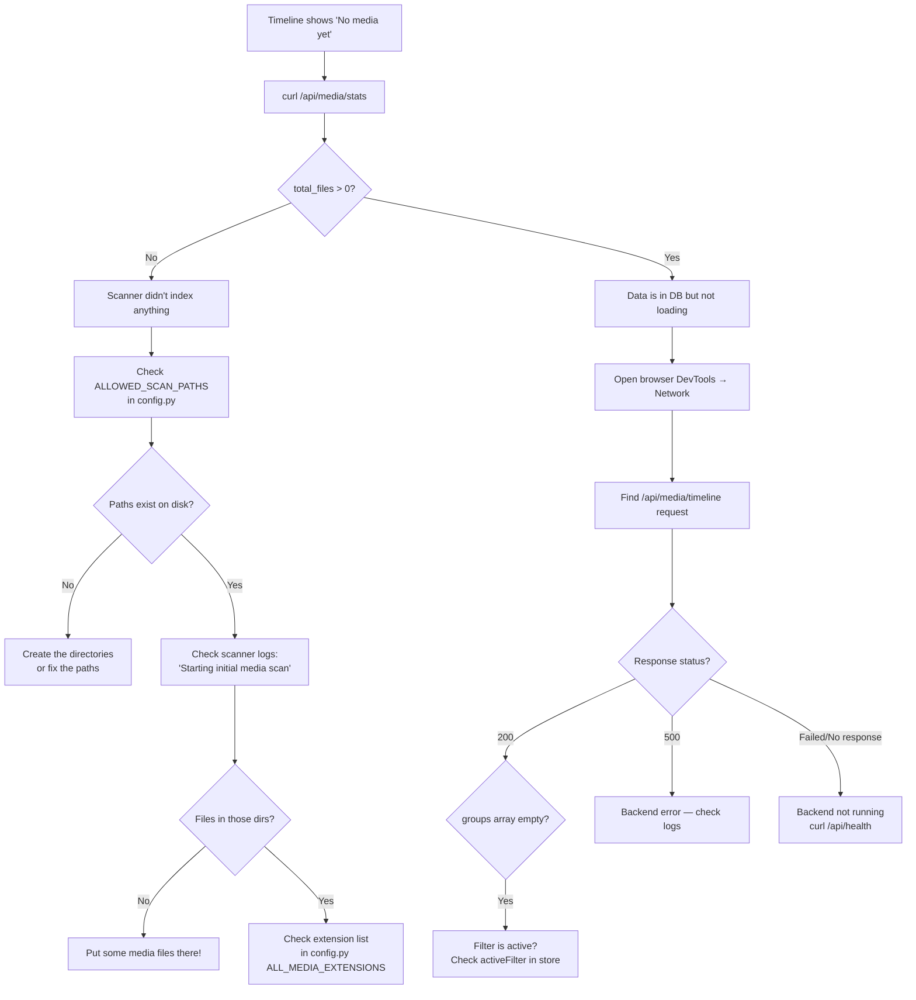
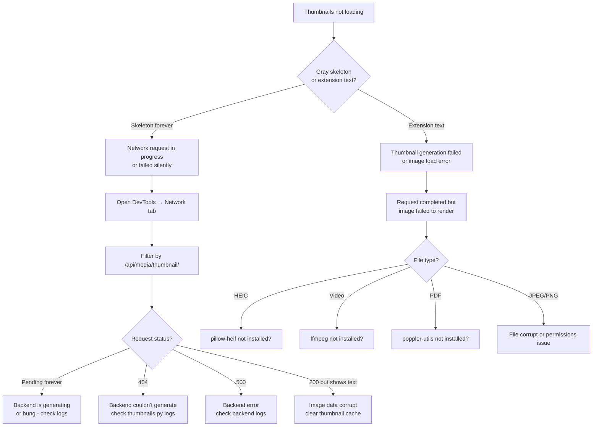

# 12 — Debugging Guide

This is the most practical document in this handbook. It teaches you exactly how to find and fix problems in Synaps.

---

## The Debugging Mindset

When something breaks, work **from the outside in**:

1. **What do you see?** (UI symptom)
2. **What request is being made?** (Network tab)
3. **What is the backend doing?** (Server logs)
4. **What is in the database?** (SQLite)
5. **What is on disk?** (Filesystem)

Never guess. Always look at the actual data.

---

## Quick Diagnostic Commands

Run these first whenever something breaks:

```bash
# Is the backend running?
curl http://localhost:8000/api/health

# Is the frontend running?
curl -I http://localhost:3000

# Does the proxy work?
curl http://localhost:3000/api/health

# How many files are indexed?
sqlite3 backend/synaps.db "SELECT COUNT(*) FROM media_files;"

# Check backend logs (last 50 lines)
journalctl -u synaps-backend -n 50
# OR if running manually:
# Just look at your terminal output
```

---

## Scenario 1: Timeline Is Empty

**Symptom**: App loads, no photos in the timeline. "No media yet" message.

### Diagnosis Tree



### Step-by-Step Fix

**Step 1**: Check what paths the scanner is looking at:
```bash
# In Python (backend):
python3 -c "from config import ALLOWED_SCAN_PATHS; print(ALLOWED_SCAN_PATHS)"
```

**Step 2**: Verify those paths exist and contain media:
```bash
ls /storage/Vault/Harsh/Iphone/
ls /storage/Vault/Harsh/Mac/
```

**Step 3**: Manually trigger a scan and watch the logs:
```bash
curl -X POST http://localhost:8000/api/scan
# Then watch logs:
journalctl -u synaps-backend -f
# You should see: "Scanning: /path..." and "Scan complete: {new: X, ...}"
```

**Step 4**: Check the database directly:
```bash
sqlite3 backend/synaps.db "SELECT COUNT(*), media_type FROM media_files GROUP BY media_type;"
```

**Step 5**: If still empty, test the API directly:
```bash
curl "http://localhost:8000/api/media/timeline?page=1&per_page=10"
```

---

## Scenario 2: Thumbnails Not Loading

**Symptom**: Photos show as gray boxes or extension text ("HEIC") instead of images.

### Diagnosis Tree



### Check Required Dependencies

```bash
# Check pillow-heif:
python3 -c "from pillow_heif import register_heif_opener; print('HEIC OK')"

# Check ffmpeg:
which ffmpeg && ffmpeg -version | head -1

# Check pdftoppm:
which pdftoppm && pdftoppm -v
```

### Clear Thumbnail Cache

If thumbnails are corrupt or stale:
```bash
rm backend/thumbnails/*.webp
# Then thumbnails will regenerate on next request
```

### Test Thumbnail Generation Manually

```bash
# Find a media ID from the database:
sqlite3 backend/synaps.db "SELECT id, filename FROM media_files LIMIT 1;"
# Copy the ID, then:
curl http://localhost:8000/api/media/thumbnail/YOUR-UUID -o test_thumb.webp
file test_thumb.webp   # Should say: RIFF ... WebP
```

### Check Thumbnail Logs

```bash
# Look for "Image thumbnail failed", "Video thumbnail failed", etc.
journalctl -u synaps-backend | grep thumbnail
# Or if dev mode:
grep "thumbnail" your_log_output.txt
```

---

## Scenario 3: Sidebar Navigation Not Working

**Symptom**: Clicking sidebar links does nothing, or sidebar is missing.

### Check 1: Is the Sidebar Rendering?

Open DevTools → Elements → Search for `class="fixed left-0 top-0"`. If not found, the sidebar isn't in the DOM at all.

**Cause**: `sidebarOpen = false` in Zustand store.  
**Fix**: Click the hamburger (☰) menu in the top-left corner.

### Check 2: Is JavaScript Running?

In DevTools Console, type:
```javascript
document.querySelector('a[href="/finder"]')
// null = link not rendered
// HTMLElement = link exists
```

### Check 3: Are There JavaScript Errors?

Look for red text in the DevTools Console. A JavaScript error in any component can break the entire React tree below that component.

Common error: `TypeError: Cannot read properties of null (reading '...')` — means a variable is null when code expected an object.

### Check 4: Is Next.js Routing Working?

```javascript
// In browser console:
window.location.href   // Current URL
// Then click a link... does the URL change?
```

If the URL changes but content doesn't update, the component might be re-rendering incorrectly.

---

## Scenario 4: Timeline Shows Duplicate Items

**Symptom**: The same photo appears multiple times in the grid.

### Possible Causes and Fixes

**Cause 1: Frontend merge bug**

The `loadedIdsRef` deduplication should prevent this. Check if the ref is being reset properly.

Debug:
```javascript
// In browser console, after seeing duplicates:
// This doesn't work directly from console, but add this temp code to page.tsx:
console.log('Loaded IDs:', loadedIdsRef.current.size, 'Groups items total:', groups.reduce((acc, g) => acc + g.items.length, 0));
```

**Cause 2: Same file in two different locations (both scanned)**

```bash
sqlite3 backend/synaps.db "
SELECT file_hash, COUNT(*) as count, GROUP_CONCAT(path) as paths 
FROM media_files 
GROUP BY file_hash 
HAVING count > 1
LIMIT 10;"
```

If you see the same hash with multiple paths, the same file exists in multiple directories and both got scanned.

**Fix**: Remove one of the indexed paths:
```bash
sqlite3 backend/synaps.db "DELETE FROM media_files WHERE path = '/the/duplicate/path';"
```

**Cause 3: Database has duplicate rows (bug)**

```bash
sqlite3 backend/synaps.db "
SELECT id, COUNT(*) as count FROM media_files 
GROUP BY id HAVING count > 1;"
# Should return no rows (UUID is primary key, cannot be duplicated)
```

---

## Scenario 5: Uploads Failing

**Symptom**: Files show "Error" status on the Sync page.

### Check the Error Message

The Sync page shows `item.message` under each file. Common messages:

| Message | Cause | Fix |
|---------|-------|-----|
| "No filename provided" | File has no name | Not user-fixable |
| "Unsupported file type: .xxx" | Extension not in `ALL_MEDIA_EXTENSIONS` | Add extension to `config.py` |
| Network error | Backend not running or request failed | Check backend health |
| "Failed to move file" | Permission error on target dir | Check dir permissions |

### Check Target Directory Permissions

```bash
# Does the target directory exist?
ls /storage/Vault/Harsh/Iphone/

# Can the backend process write to it?
touch /storage/Vault/Harsh/Iphone/test.txt
rm /storage/Vault/Harsh/Iphone/test.txt
```

### Test Upload Directly

```bash
curl -X POST http://localhost:8000/api/sync/upload \
  -F "file=@/path/to/test_photo.jpg" \
  -F "device=test"
```

---

## Scenario 6: Backend Crash on Startup

**Symptom**: Backend starts briefly then exits. Timeline never loads.

### Check the Error

```bash
cd backend && source venv/bin/activate
python main.py
# Read the error output
```

Common startup errors:

```
ModuleNotFoundError: No module named 'fastapi'
```
→ `pip install -r requirements.txt`

```
sqlite3.OperationalError: unable to open database file
```
→ Backend doesn't have write permissions in its directory

```
OSError: [Errno 98] Address already in use: ('0.0.0.0', 8000)
```
→ Something is already on port 8000: `lsof -i :8000 | grep LISTEN; kill PID`

---

## Scenario 7: API Returns 500 Error

**Symptom**: Browser shows errors, API returns HTTP 500.

### How to Debug a 500 Error

**Step 1**: Get the exact error from the API:
```bash
curl http://localhost:8000/api/media/timeline 2>&1
# Response will include {"detail": "..."} 
```

**Step 2**: Check backend logs for the full traceback:
```bash
journalctl -u synaps-backend -n 50 | grep -A 20 "ERROR"
```

A FastAPI 500 error always logs the full Python traceback. The traceback shows:
- Which file and line number caused the error
- The exception type and message
- The call stack

**Step 3**: Reproduce the error with the exact same request and read the traceback.

---

## React Debugging Tools

### Browser DevTools — Console Tab

```javascript
// Check current path
window.location.pathname  // "/finder"

// Check if elements exist
document.querySelector('.media-grid')  // null = MediaGrid not rendered

// Monitor API calls (add to api.ts temporarily):
async function fetchAPI(endpoint, options) {
  console.log('API call:', endpoint);
  const res = await fetch(...);
  const data = await res.json();
  console.log('API response:', endpoint, data);
  return data;
}
```

### Browser DevTools — Network Tab

1. Open DevTools (F12)
2. Click "Network"
3. Reload the page
4. Look for:
   - **Red rows**: Failed requests (4xx, 5xx, or network errors)
   - **Pending forever**: Requests that started but haven't completed
   - **Response body**: Click any request → "Preview" or "Response" tab

For thumbnail requests, filter by `/api/media/thumbnail/`:
- If `200 OK` but image looks wrong → corrupt WebP → clear thumbnail cache
- If `404` → backend couldn't find/generate the thumbnail
- If `500` → backend error (check logs)

### React DevTools Extension

Install "React Developer Tools" for Chrome/Firefox. Then:
- **Components tab**: Inspect component tree, see all state and props
- **Profiler tab**: Record renders to find performance bottlenecks

---

## Database Debugging

```bash
# Open interactive SQLite shell
sqlite3 backend/synaps.db

# Useful queries:
.tables                    # List all tables

-- Count files by type
SELECT media_type, COUNT(*) FROM media_files GROUP BY media_type;

-- Files with no thumbnail
SELECT COUNT(*) FROM media_files WHERE has_thumbnail = 0;

-- Files where path no longer exists (orphaned)
-- (can't do this in SQL — need to do in Python)

-- Last 10 files indexed
SELECT filename, date_indexed FROM media_files ORDER BY date_indexed DESC LIMIT 10;

-- Files with broken dates (NULL date_taken is OK; but date_taken in 1970 suggests filesystem timestamp bug)
SELECT COUNT(*) FROM media_files WHERE date_taken < '1990-01-01';

-- Trash items expiring soon
SELECT filename, auto_delete_at, days_remaining FROM (
  SELECT filename, auto_delete_at,
    CAST((julianday(auto_delete_at) - julianday('now')) AS INTEGER) as days_remaining
  FROM trash_items
) WHERE days_remaining < 7;

.quit
```

---

## Tracing a Specific Bug: "My Photo Doesn't Show in Timeline"

1. Find the file path on disk
2. Check if it was scanned:
```bash
sqlite3 backend/synaps.db "SELECT id, filename, date_taken FROM media_files WHERE filename = 'IMG_4532.HEIC';"
```
3. If not found, check if its directory is in `ALLOWED_SCAN_PATHS`
4. Check the extension is in `ALL_MEDIA_EXTENSIONS`
5. Trigger a rescan and watch logs
6. If scanned, check if timeline API returns it:
```bash
curl "http://localhost:8000/api/media/timeline?per_page=200" | python3 -m json.tool | grep "IMG_4532"
```
7. If API returns it, check if frontend is filtering it out (active filter?)

---

## Log Level Tuning

To see more detailed logs from the backend:

```python
# In main.py, change:
logging.basicConfig(level=logging.INFO, ...)
# To:
logging.basicConfig(level=logging.DEBUG, ...)
```

To see SQL queries (very verbose — use temporarily only):
```python
# In database.py, change:
engine = create_engine(DATABASE_URL, echo=False)
# To:
engine = create_engine(DATABASE_URL, echo=True)
```

This prints every SQL query to stdout. Useful for diagnosing slow database operations.
