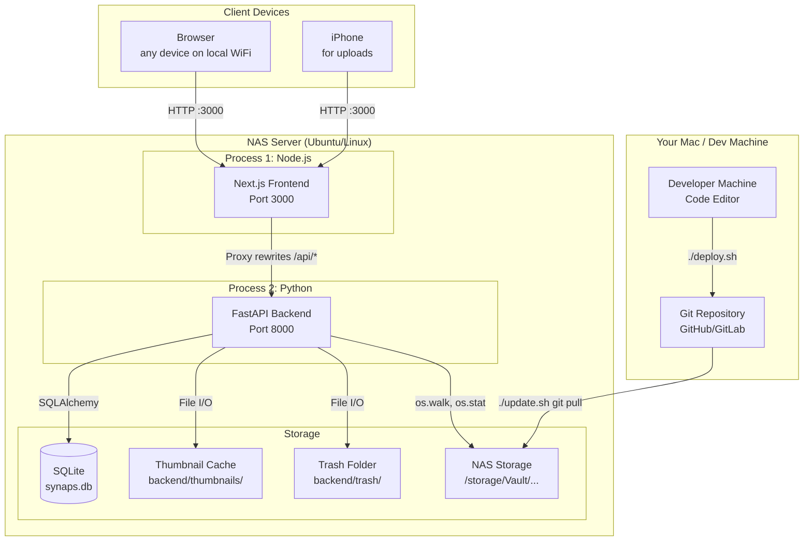
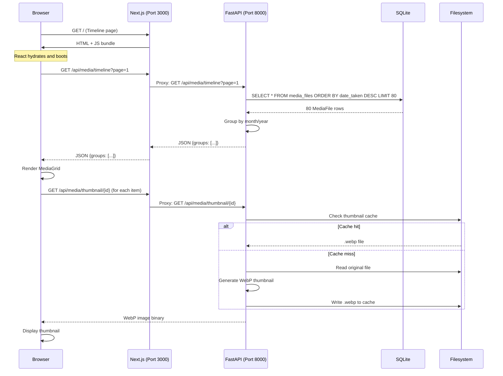
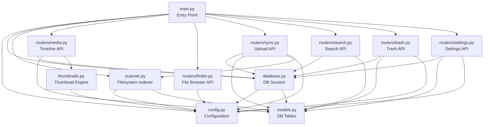
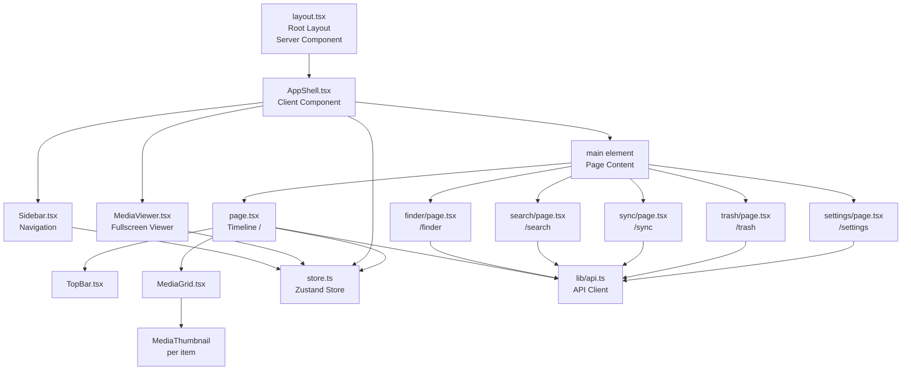
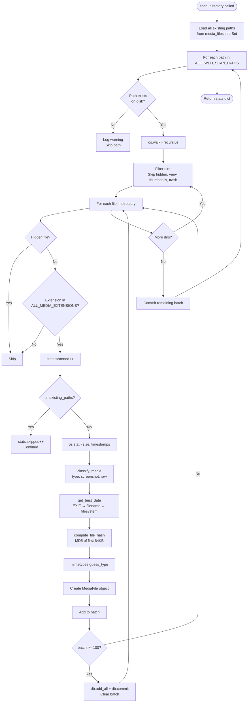
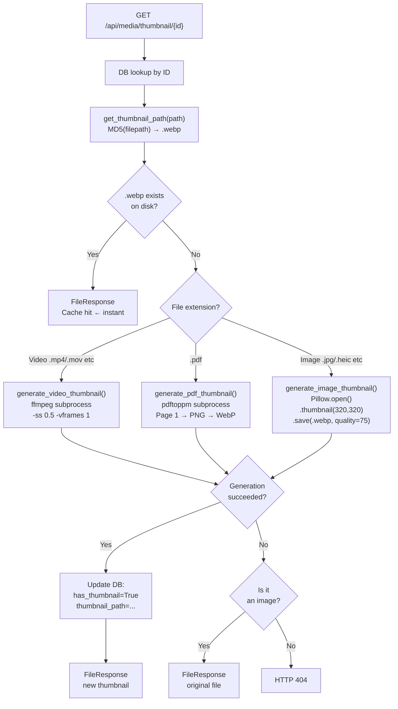
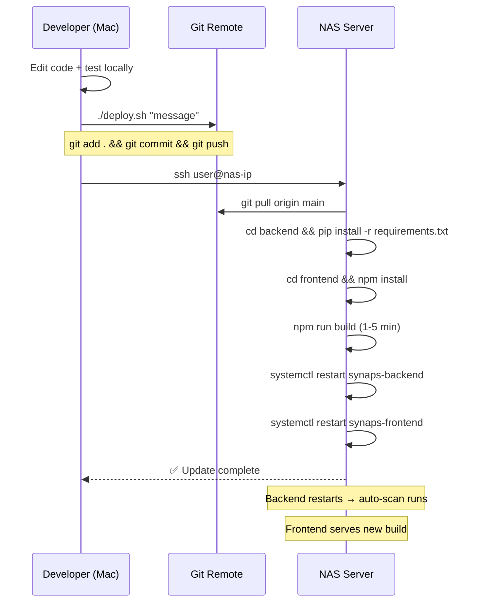
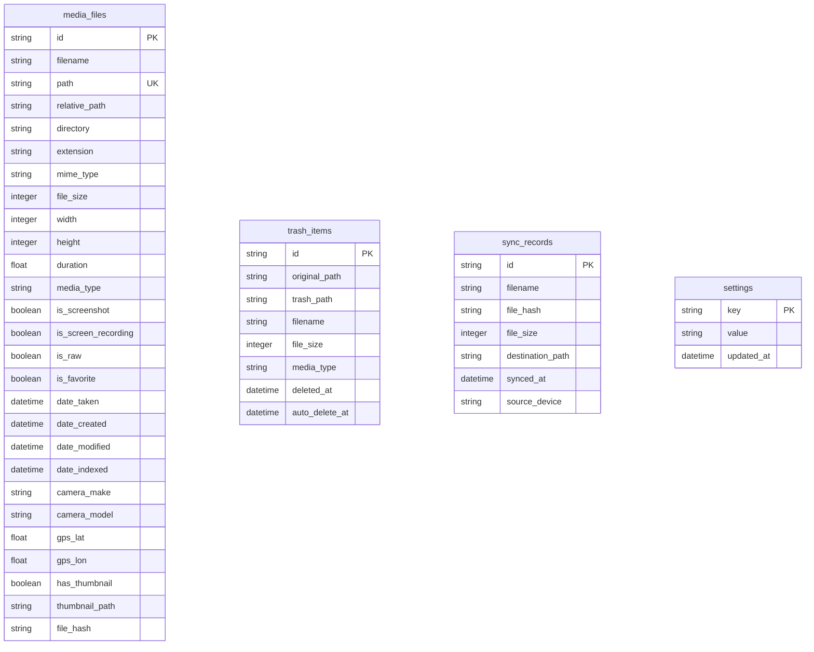
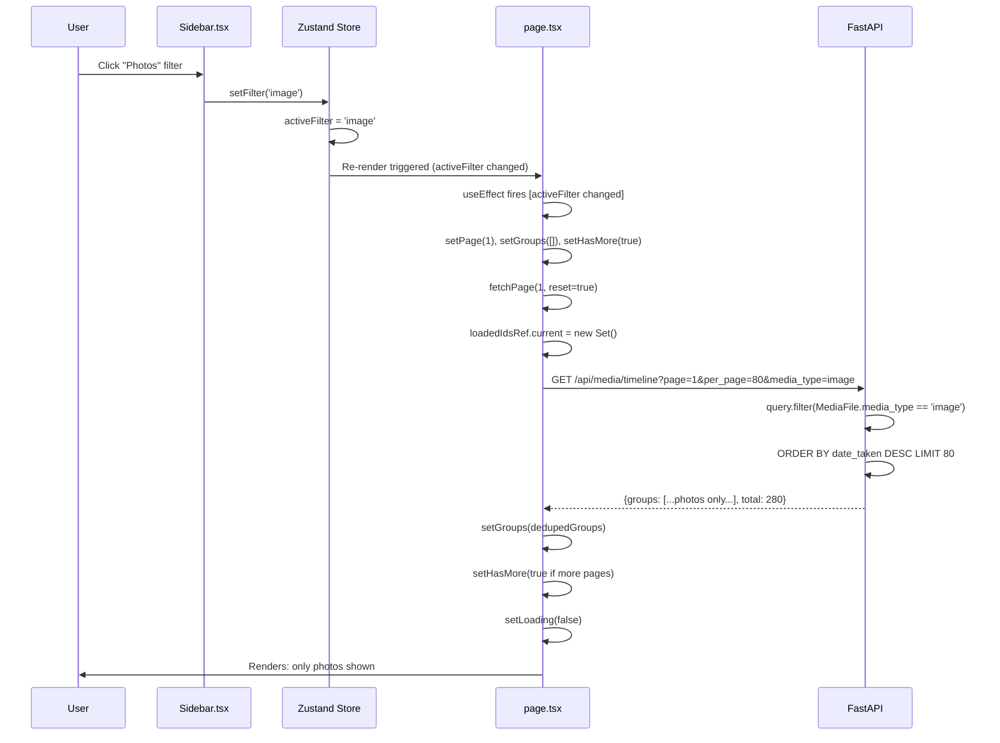

# Synaps Architecture Diagrams

This file contains all major architecture and flow diagrams for the Synaps project.

---

## 1. Full System Architecture



---

## 2. Request Lifecycle



---

## 3. Backend Module Dependency Graph



---

## 4. Frontend Component Tree



---

## 5. Scanner Flow



---

## 6. Thumbnail Generation Pipeline



---

## 7. Upload/Sync Flow

```mermaid
flowchart TD
    SELECT[User selects files\nin browser] --> QUEUE[Files added to\nUploadItem queue\nstatus: pending]
    QUEUE --> UPLOAD_BTN[User clicks Upload]
    UPLOAD_BTN --> LOOP[Loop: for each pending file]
    
    LOOP --> SET_UPLOADING[Set status: uploading]
    SET_UPLOADING --> POST["POST /api/sync/upload\nmultipart/form-data"]
    
    POST --> READ[await file.read()\nAll content into RAM]
    READ --> HASH_FULL[MD5 of entire file\nhashlib.md5 content]
    HASH_FULL --> CHECK_SYNC{In sync_records?}
    
    CHECK_SYNC -- Yes --> RETURN_DUP1[Return: duplicate]
    CHECK_SYNC -- No --> CHECK_MEDIA{In media_files?}
    
    CHECK_MEDIA -- Yes --> RETURN_DUP2[Return: duplicate]
    CHECK_MEDIA -- No --> MKDIR[makedirs YEAR/MONTH/]
    
    MKDIR --> COLLISION{Filename\nexists?}
    COLLISION -- Yes --> RENAME[Add _1 _2 suffix]
    COLLISION -- No --> WRITE[Write file to disk]
    RENAME --> WRITE
    
    WRITE --> RECORD[INSERT sync_records]
    RECORD --> RETURN_OK[Return: success]
    
    RETURN_DUP1 --> UI_UPDATE[Update UI status]
    RETURN_DUP2 --> UI_UPDATE
    RETURN_OK --> UI_UPDATE
    
    UI_UPDATE --> LOOP
    LOOP --> DONE[All files processed]
    DONE --> NOTE[Note: New files\nNOT in timeline yet\nRequires rescan]
```

---

## 8. State Management Flow

```mermaid
graph LR
    subgraph "Zustand Store (store.ts)"
        SIDEBAR_STATE[sidebarOpen: boolean]
        VIEWER_STATE[viewerOpen: boolean\nviewerMediaId: string|null]
        FILTER_STATE[activeFilter: string|null]
    end

    subgraph "Components That Write"
        TOPBAR_W[TopBar\ntogglesidebar click]
        SIDEBAR_W[Sidebar\nsidebarOpen close\nsetFilter click]
        MEDIATHUMB_W[MediaThumbnail\nopenViewer on click]
        VIEWER_W[MediaViewer\ncloseViewer on X/Escape]
    end

    subgraph "Components That Read"
        APPSHELL_R[AppShell\n← sidebarOpen\nfor ml-260px]
        SIDEBAR_R[Sidebar\n← sidebarOpen\nfor AnimatePresence\n← activeFilter\nfor active style]
        VIEWER_R[MediaViewer\n← viewerOpen\n← viewerMediaId]
        TIMELINE_R[page.tsx\n← activeFilter\nfor API filter param]
    end

    TOPBAR_W --> SIDEBAR_STATE
    SIDEBAR_W --> SIDEBAR_STATE
    SIDEBAR_W --> FILTER_STATE
    MEDIATHUMB_W --> VIEWER_STATE
    VIEWER_W --> VIEWER_STATE

    SIDEBAR_STATE --> APPSHELL_R
    SIDEBAR_STATE --> SIDEBAR_R
    FILTER_STATE --> SIDEBAR_R
    FILTER_STATE --> TIMELINE_R
    VIEWER_STATE --> VIEWER_R
```

---

## 9. Deployment Flow



---

## 10. Database Entity Relationship Diagram



---

## 11. Data Flow When Filter Changes


